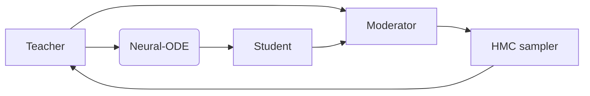

## Classical Monte Carlo

### Monte Carlo Method

Propose-reject method: Given a distribution $p(x)$, we want to sample from it. We can propose a distribution $q(x)$, and accept the sample with probability $\alpha(x)=\frac{p(x)}{q(x)}$.

Accept:
$$\min\left(1,\frac{p(x)}{q(x)}\right)$$

PRNG generator: $x_{n+1}=f(x_n)$

- Has a period
- Might not be evenly distributed
- Repeatability: same seed, same sequence

Good random number generator:

- Long period
- Weak correlation
- Uniform distribution

How to generate complex distribution from uniform distribution?

An example: Box-Muller transform

$$
\begin{aligned}
x_1 &= \sqrt{-2\ln u_1}\cos(2\pi u_2)
\end{aligned}
$$

where $u_1u_2$ are uniform distribution in $[0,1]$

Then $x_1$ are Gaussian distribution with $\mu=0,\sigma=1$

Walker's alias method: This method have a table of random number, and a table of alias, and a table of probability. The probability table is the target distribution, and the alias table is the uniform distribution. The random number table is used to determine which table to use.

Example:

```python
import numpy as np
import matplotlib.pyplot as plt

outcomes = np.array(["A", "B", "C", "D"])
probabilities = np.array([0.25, 0.3, 0.1, 0.35])

n = len(outcomes)
probabilities = probabilities * n

prob_table = np.zeros(n)
alias_table = np.zeros(n, dtype=int)

overfull = []
underfull = []

for i, p in enumerate(probabilities):
    if p > 1:
        overfull.append(i)
    elif p < 1:
        underfull.append(i)
    else:
        prob_table[i] = p
        alias_table[i] = i

while overfull and underfull:
    i = overfull.pop()
    j = underfull.pop()
    prob_table[j] = probabilities[j]
    alias_table[j] = i
    probabilities[i] = probabilities[i] - (1 - probabilities[j])
    if probabilities[i] > 1:
        overfull.append(i)
    elif probabilities[i] < 1:
        underfull.append(i)
    else:
        prob_table[i] = probabilities[i]
        alias_table[i] = i

print(prob_table)
print(alias_table)

x = np.random.rand() * n
i = int(x)
y = np.random.rand()
if y < prob_table[i]:
    outcome = outcomes[i]
else:
    outcome = outcomes[alias_table[i]]
plt.bar(outcomes, probabilities / n) # normalize back to original probabilities
plt.scatter(x, y, color="red")
plt.xlabel("Outcome")
plt.ylabel("Probability")
plt.show()

```


### Cluster and Worm Algorithm

### Methods for long-range interacting systems

### Irreversible Monte Carlo Method

对所要研究的物理系统，我们通常已知系统的哈密顿量$H(x)$，如果$x$是系统的微观状态，那么在不同的外部条件下，系统在达到热力学平衡态的状态分布函数$p(x)$各不相同，为了便于讨论，我们这里限定在粒子数、体积、温度三个宏观参数不变的经典情况下，即$NVT$系综。

自由能：
在$NVT$系综下，系统的平衡态状态分布函数$p(x)$满足
$$
\begin{align}
p(x)\propto \exp[-\beta H(x)]
\end{align}
$$
其中$\beta=1/k_B T$，$k_B$为玻尔兹曼常数，$T$为温度，$x$为系统的微观状态，$H(x)$为系统的哈密顿量。
本文所需要估计的自由能定义为
$$
\begin{align}
F=-k_B T \ln Z
\end{align}
$$
其中$Z=\int dx\exp[-\beta H(x)]$为系统的配分函数。
对于粒子数$N$较多的情况，$x\in \mathbb{R}^{3N}$，$H(x)$的维度也很高，$\exp[-\beta H(x)]$非常复杂，因此直接计算$Z$是困难的。

自由能微扰（Free Energy Perturbation）通过将问题转化为计算自由能差，避免了对不易采样的复杂分布进行直接计算的问题。
如果对$A$系统的采样容易，而对$B$系统的采样困难，我们可以通过仅对$A$采样来得到自由能差$\Delta F$

Perturbation Equality:
对两个平衡态下的热力学系统$A$和$B$，其配分函数分别为$Z_A$和$Z_B$，自由能分别为$F_A$和$F_B$，则自由能差$\Delta F=F_B-F_A=-k_B T \ln \frac{Z_B}{Z_A}$
可以通过对$A$采样算出：
$$
\begin{align}
\left \langle e^{-\Delta H / k T}\right\rangle_A=e^{-\Delta F / k T}
\end{align}
$$

实际上，该方法就是重要性采样（Importance Sampling）的一个特例。

重要性采样:
设 $f(\mathbf{x})$ 是一个定义在 $\mathbb{R}^d$ 上的函数，$p(\mathbf{x})$ 是一个定义在同一空间上的概率密度函数，满足 $p(\mathbf{x})>0$ 当且仅当 $f(\mathbf{x})\neq 0$。则有：
$$
\begin{align*}
\int_{\mathbb{R}^d} f(\mathbf{x})d\mathbf{x} &= \int_{\mathbb{R}^d} \frac{f(\mathbf{x})}{p(\mathbf{x})}p(\mathbf{x})d\mathbf{x} \\
&= E_p\left[\frac{f(\mathbf{X})}{p(\mathbf{X})}\right]
\end{align*}
$$
其中 $\mathbf{X}$ 是一个服从 $p(\mathbf{x})$ 分布的随机向量，$E_p[\cdot]$ 表示关于 $p(\mathbf{x})$ 的期望。如果我们从 $p(\mathbf{x})$ 中独立地抽取 $n$ 个样本 $\{\mathbf{x}_1,\mathbf{x}_2,\dots,\mathbf{x}_n\}$，则可以用以下公式来估计积分：
$$
\begin{align*}
\int_{\mathbb{R}^d} f(\mathbf{x})d\mathbf{x} \approx \frac{1}{n}\sum_{i=1}^n \frac{f(\mathbf{x}_i)}{p(\mathbf{x}_i)}
\end{align*}
$$

其中，$p(\mathbf{x})$是易于采样的，而$f(\mathbf{x})$则是我们希望计算的难以采样的函数。通常我们把得到的样本$x_i$叫做重要性样本，而$\omega_i = f(\mathbf{x_i})/p(\mathbf{x_i})$叫做重要性权重。

因此，FEP方法的误差可以通过重要性采样的方差来进行估计。根据方差的定义：
$$
\begin{align}
\text{Var}_p\left[\frac{f(\mathbf{X})}{p(\mathbf{X})}\right] = E_p\left[\left(\frac{f(\mathbf{X})}{p(\mathbf{X})}\right)^2\right] - \left(E_p\left[\frac{f(\mathbf{X})}{p(\mathbf{X})}\right]\right)^2
\end{align}
$$
由于 $E_p\left[\frac{f(\mathbf{X})}{p(\mathbf{X})}\right] = \int_{\mathbb{R}^d} f(\mathbf{x})d\mathbf{x}$ 是一个常数，所以方差的大小取决于 $E_p\left[\left(\frac{f(\mathbf{X})}{p(\mathbf{X})}\right)^2\right]$ 的大小。如果我们能找到一个 $p(\mathbf{x})$ 使得 $\frac{f(\mathbf{x})}{p(\mathbf{x})}$ 的变化不大，那么方差就会比较小。

FEP的误差界限:
将 $f(\mathbf{x})$ 替换为 $e^{-H_B / k T}$，$p(\mathbf{x})$ 替换为 $e^{- H_A / k T}/Z_A$，则有：
$$
\begin{align*}
     \text{Var}_p\left[\frac{f(\mathbf{X})}{p(\mathbf{X})}\right] \leq \sup_{\mathbf{x}} \frac{|f(\mathbf{x})|^2}{p(\mathbf{x})^2} = Z_A^2\sup_{\mathbf{x}} \frac{e^{-2H_B / k T}}{e^{-2 H_A / k T}} = Z_A^2\sup_{\mathbf{x}} e^{-2(H_B-H_A) / k T}
\end{align*}
$$

这个界限说明，如果我们找到了一个 $p(\mathbf{x})$ 使得 $\sup_{\mathbf{x}} e^{-2(H_B-H_A) / k T}$ 非常小，那么就可以让误差降低到一个非常小的值。例如，让$H_B>>H_A$，那么 $\sup_{\mathbf{x}} e^{-2(H_B-H_A) / k T}\approx 0$，此时我们还可以调整$Z_A$。

更严格的推导给出 方差 $\text{Var}_p = \int_{\Omega} \frac{f^2(x)}{p(x)} d \mu(x)-I^2$，带入 $f(x)=e^{-H_B(x) / k T}$，$p(x)=e^{-H_A(x) / k T} / Z_A$，则有 $\text{Var}_p=Z_A \int_{\Omega} e^{(H_A-2H_B)/kT} d \mu(x)-I^2$

> How to evaluate the errors of MCMC?

- Variance of the estimator: $\text{Var}(\hat{F})=\frac{1}{N}\text{Var}(f(x))$
- Autocorrelation time: $\tau=\frac{1}{2}+\sum_{t=1}^{\infty} \rho(t)$, where $\rho(t)=\frac{\text{Cov}(f(x),f(x+t))}{\text{Var}(f(x))}$

为了减小误差，在FEP的基础上，人们提出了许多改进方法，主要分为两类。

Multi-State Method:

第一类是多态方法（Multi-State Method），其基本思想是将目标分布分成多个区域，然后分别计算每个区域的自由能差，最后将结果相加。图$\text{\red{???}}$的(a)展示了这一方法的基本思路，其中每个区域的自由能差可以通过FEP计算得到。这类方法包括热力学积分（Thermodynamics Integraton）等，最常用的是MBAR(Multistage Bennett Acceptance Ratio).

MBAR:
设 $u_0(\mathbf{x})$ 是一个目标能量函数，$u_1(\mathbf{x}),u_2(\mathbf{x}),\dots,u_n(\mathbf{x})$ 是一组参考能量函数，它们都定义在相同的相空间 $\Omega$ 上。设 $\{\mathbf{x}_1,\mathbf{x}_2,\dots,\mathbf{x}_n\}$ 是一组从参考能量函数对应的玻尔兹曼分布中采样的样本。则目标能量函数对应的归一化常数 $Z_0 = \int_{\Omega} \exp(-\beta u_0(\mathbf{x})) d\mathbf{x}$ 可以用以下公式来估计：
$$
\begin{align*}
Z_0 &\approx \frac{1}{\sum_{j=1}^n w_j \exp(-u_j(\mathbf{x}_i) + u_0(\mathbf{x}_i))} \\
&= \frac{1}{\sum_{j=1}^n w_j Z_j/Z_0 \exp(-u_j(\mathbf{x}_i) + u_0(\mathbf{x}_i))}
\end{align*}
$$
其中 $w_i = \frac{\exp(-u_0(\mathbf{x}_i))}{\sum_{j=1}^n w_j \exp(-u_j(\mathbf{x}_i) + u_0(\mathbf{x}_i))}$ 是每个样本的权重，$Z_j = \int_{\Omega} \exp(-\beta u_j(\mathbf{x})) d\mathbf{x}$ 是每个参考能量函数对应的归一化常数，$k_B$ 是玻尔兹曼常数，$T$ 是温度，$\beta = 1/k_B T$ 是逆温度。
\end{theorem}

MBAR的理论基础是最大熵原理，它是一种从有限的信息中推断出最可能的概率分布的方法。MBAR假设目标分布的归一化常数 $Z_0$ 是未知的，但是我们有一些其他的分布的归一化常数 $Z_1,Z_2,\dots,Z_n$，以及每个分布对应的样本 $\{\mathbf{x}_1,\mathbf{x}_2,\dots,\mathbf{x}_n\}$。MBAR的目标是找到一个权重向量 $\mathbf{w} = (w_1,w_2,\dots,w_n)$，使得以下条件成立：

- $\sum_{i=1}^n w_i = 1$，即权重之和为1。
- $\sum_{i=1}^n w_i \exp(-u_j(\mathbf{x}_i) + u_0(\mathbf{x}_i)) = Z_j/Z_0$，对于任意 $j=1,2,\dots,n$，即每个分布的归一化常数与目标分布的归一化常数之比等于样本的加权平均。

这些条件可以用拉格朗日乘子法来求解，得到以下结果：

- $w_i = \frac{\exp(-u_0(\mathbf{x}_i))}{\sum_{j=1}^n w_j \exp(-u_j(\mathbf{x}_i) + u_0(\mathbf{x}_i))}$，即每个样本的权重与目标分布和其他分布的能量函数有关。
-$Z_0 = \frac{1}{\sum_{j=1}^n w_j \exp(-u_j(\mathbf{x}_i) + u_0(\mathbf{x}_i))}$，即目标分布的归一化常数与其他分布的归一化常数和样本有关。
由于这些结果是互相依赖的，所以需要用迭代的方法来求解。

这个方法虽然解决了两个分布差异较大的问题，但由于中间态的设计，使得我们需要对多个分布进行采样，计算量较大，且采样的马尔可夫过程必须进行足够多的次数，使得样本分布去关联（decorrelate），才能显著降低误差。

Targeted Free Energy Perturbation:
Targeted Free Energy Perturbation绕过了这个问题，其基本思想是将其中一个分布（如初始分布）通过变量代换$M$进行转换，得到一个和目标分布重叠较高的分布，然后再进行FEP计算，如图

Targeted Free Energy Perturbation:
对两个平衡态下的热力学系统$A$和$B$，其配分函数分别为$Z_A$和$Z_B$，自由能分别为$F_A$和$F_B$，若存在可逆变换$M: x\to y(x)$，则自由能差$\Delta F=F_B-F_A=-k_B T \ln \frac{Z_B}{Z_A}$
可以通过对$A$采样算出：
$$
    \begin{align}
        \left \langle e^{-\Delta \Phi / k T}\right\rangle_A=e^{-\Delta F / k T}
    \end{align}
$$
其中$\Phi(x) = E_B(y) - E_A(x)-kT\ln{\vert \frac{\partial y}{\partial x} \vert}$，$E_A(x)$和$E_B(y)$分别为$A$和$B$的能量函数

从重要性采样的角度来看，这是非常平凡的思路，困难从寻找$p(x)$转变为寻找变换$M$，使得$p(M(x))$与目标分布$f(y)$重叠较高（此处$x$代表$A$体系的一个微观状态，$y$代表$B$体系的微观状态）。但考虑到变换的灵活性，我们可以设置任意易于采样的$A$，而无需要求其满足热力学平衡，一种最简单的思路是让$A$满足多维正态分布，然后通过线性变换靠近目标分布.

蒙特卡洛采样:

通过分析，我们注意到，目前主流的方法几乎都是基于重要性采样，所谓的MBAR, TFEP只是在此基础上的调整，以不同的方式来设计概率分布$p(x)$，使得其与目标分布$f(y)$重叠较高。一些叫做增强采样（Enhanced Sampling）的方法，如伞形采样（Umbrella Sampling），本质上也是重要性采样。因此，将自由能估计问题转化到更一般的采样理论框架下（而这一领域正在快速发展），能为我们提供更多思路。本节将介绍一些重要的进展。

### 采样方法的主要分类

所有的采样可以分为调查采样（Survey Sampling）和概率分布采样（Sampling from Probability Distrbutions），调查采样是从一个数据集或总体中抽取样本，概率分布采样是从一个概率密度或概率质量函数（即离散的概率密度）中抽取样本。自由能估计问题通常属于后者。

概率分布采样通常要求我们知道系统的累计分布函数（Cumulative Distribution Function，CDF），但对于复杂的分布，这通常无法完成。因此多数情况下都是基于蒙特卡洛方法的.

蒙特卡洛方法可以分为简单蒙卡（Simple MC），马尔科夫链蒙卡（MCMC）和高效蒙卡（Efficient MC）。简单蒙卡是指样本独立同分布，没有相互依赖，这包括重要性采样、接受拒绝采样等。而马尔科夫链蒙卡每次迭代/步骤都依赖于前一个迭代/步骤，具有马尔可夫性质。方法包括Metropolis算法、Metropolis-Hastings算法、Gibbs采样、切片采样等。高效蒙卡是更少进行重复采样，不需要或很少被拒绝，因而可以快速收敛到后验分布的蒙卡采样算法，如混合蒙卡（HMC）、郎之万动力学采样（Langevin Dynamics）。关于这些内容的更完整讨论可以参考下面简要介绍一些代表性方法目前的新进展，以及和自由能估计的紧密关系。

#### 重要性采样


Given a quantity $x$ with distribution probability $\propto f(x)$, we want to calculate the expectation of  a function $a(x)$, this can be done by

$$
\bar{a}= \frac{1}{\blue{Z_f}}\int dx f(x) a(x)
$$

where $\blue{Z_f}=\int dx f(x)$ is the normalization factor.  The problem is that we cannot sample from $f(x)$ directly.

 In the case of statistical physics, $f(x)=\exp{(-\beta H(x))}$ and $Z_f$ are often intractable.

A general proposal of Importance Samping is using a tractable distribution $g(x)$, with $Z_g=\int dx g(x)$ easy to calculate.

But this will lead to large error, to facilitate with this, we introduce **Importance Weight  $\omega(x):={f(x)}/{g(x)}$**, so

$$
f(x)=g(x)\omega(x)
$$

Plug this into the aobve equation, we get

$$
\begin{aligned}
\bar{{{a}}}
%= \frac{Z_f}{{\red{Z_g}}}\int dx g(x) \green{\omega(x)}a(x)

& = \frac{1}{\blue{Z_f}}\int dx f(x) a(x)

\\& = \frac{1}{\int dx f(x)}\int dx f(x) a(x)

\\ & =\frac{1}{\int dx g(x)
\green{\omega(x)}}\int dx g(x) \green{\omega(x)}a(x)

\\ & \approx \frac{\sum_i \green{\omega(x_i)}a(x_i)}{\sum_i \green{\omega(x_i)}}
\end{aligned}
$$

where $x_i$ is sampled from $g(x)$.

one interesting property is $\sum_i \omega(x_i) /N =Z_f/Z_g$

Cons: If $g(x)$ is not close to $f(x)$, the weight $\green{\omega(x)}$ varies violently, leading to significant errors.

#### Metroplis-Hastings

(Metropolis, et al 1953; Hastings 1970) proposed the well-known Metropolis-Hasting algorithm using MCMC.

<aside>
💡 This algorithm designed a Markov Chain to sample from certain distribution

$$
\frac{dp_a}{dt}=0
$$

and

$$
\frac{dp_a}{dt}=\sum_b (\omega_{b \to a}p_b - \omega_{a\to b}p_a)
$$

so

$$
\sum_b (\omega_{b \to a}p_b - \omega_{a\to b}p_a) =0
$$

Detailed balance satisfies this

$$
\omega_{b \to a}p_b = \omega_{a\to b}p_a  \to \\\omega_{b\to a}/\omega_{a\to b}=p_a/p_b
$$

Consider metropolis step to generate $p(x)\propto \exp[-\beta E(x)]$

using the metropolis creterion:

$$
\omega_{a\to b}=\min\left(1,\frac{p_b}{p_a}\right)=\min\left(1,\exp[-\beta(E_b-E_a)]\right)
$$

we can derive that

$$
\omega_{b\to a}/\omega_{a\to b}=p(x_a)/p(x_b)
$$

Using this, we can design a Markov process and sample from the distribution $p$, get $x_n$, and the estimation would be

$$
F_N=\frac{1}{N}\sum_n^N F(x_n)
$$

Another creterion:

$$
\omega_{a\to b} = \pi_{a}A_{a\to b}P_{a\to b}
$$

where $A_{a\to b}$ is the proposal probability, $P_{a\to b}$ is the acceptance probability, and $\pi_{a}$ is the probability of choosing $a$.

> How fast does MC converge?
>
> Theorem: If the Markov chain is irreducible, aperiodic, and positive recurrent, then the MC converges to the stationary distribution $p(x)$.

</aside>

#### 退火重要性采样

Kirkpatrick, Gelatt, and Vecchi (1983) introduced Simulated Annealing to solve the problem of MH algorithm

💡 We want to sample distribution $p_0$, but

- start from $p_n=p_0^{\beta_n}$ using MH algorithm
- after a few iterations, switch from $j$ to $j-1$, and repeat the above process from final state

$1=\beta_0 > \beta_1 > \cdots > \beta_n$

上文已经介绍了重要性采样，并指出目前主流的自由能估计方法（包括一些增强采样方法）本质上也是重要性采样。Jarzynski曾提出一种通过非平衡热力学过程估计自由能的方案，neal1998annealed则独立的提出了退火采样（Annealed Importance Sampling），是重要性采样领域较新的进展，其本质上是融合了重要性采样和蒙特卡洛方法，通过退火的方式避免了蒙特卡洛方法中的样本相关性问题。

Annealed Importance Sampling:
对未知的概率分布$p_0(x)$，若假设：

- （Sequence）我们有一系列不同的分布，分别为 $p_1, \ldots, p_n$，其中当 $p_{j}(x) \neq 0$ 时，$p_{j-1}(x) \neq 0$。
- （Evaluate）对于每个分布，我们必须能够计算与 $p_j(x)$ 成比例的某些函数 $f_j(x)$。
- （Markov）对于从 $1$ 到 $n-1$ 的每个 $i$，我们能够进行保持 $p_j$ 分布不变的Markov Chain转移$T_j$。
- （Sample）$p_n$ 可以轻松进行采样。

那么，我们可以通过以下方法获得 $p_0$ 的重要性样本$x^{(i)}$和重要性权重$\omega^{(i)}$：
$$
\begin{align}
x^{(i)} = \prod_{1}^{n-1} T_j x, x \sim p_n \\
\omega^{(i)} = \prod_{0}^{n-1} \frac{f_j(x_j)}{f_{j + 1}(x_j)}
\end{align}
$$

对于其中提到的分布序列$f_j(x)$，neal1998annealed提出了一个构造方法：
$$
\begin{align}
    f_j(x)=f_0(x)^{\beta_j}f_n(x)^{1-\beta_j}\\
    \text{where} \quad 1=\beta_0 > \beta_1 > \cdots > \beta_n=0
\end{align}
$$
若取$f_n(x)=1$, $f_0(x)= e^{-\beta F(x)}$，不难看出上述的采样过程就是模拟退火，而这一思路和Jarzynski_1997的方法是一致的。


🚧 **Exercise**: Prove that Annealed Importance Sampling is Importance Sampling in the extended space $(x_0,x_1,\cdots,x_n)$

#### 基于动力学的采样

和AIS相似，基于动力学的采样也是为了解决蒙特卡洛方法中的样本相关性问题，能比Metroplis-Hastings等算法更高效的探索整个概率空间。这类方法的基本思路是通过模拟物理系统的动力学过程，从而在概率空间中探索更多的区域，从而获得更多的样本。这类方法的代表性算法包括HMC、Langevin动力学采样等。

哈密顿蒙特卡洛（Hamiltonian Monte Carlo，HMC）的基本思想是假设系统服从玻尔兹曼分布$\frac{e^{-H(X,p)}}{Z}$，即有哈密顿量$H(x,p)$，其中$x$为系统的状态，$p$为系统的动量（对于部分系统，需要人为定义），$H(x,p)$为系统的总能量。系统的状态随时间的变化服从以下的哈密顿方程:
$$
\begin{align}
&\dot{x} = p, \\
&\dot{p} = -\frac{\partial E(x)}{\partial x},
\end{align}
$$
实际上，分子动力学（MD）也是通过同样的方式来逐渐逼近最终分布，但区别在于：MD可以模拟系统的长时演化、为了精度和数值稳定性需要小步长、容易陷入极值点，而HMC可以用大步长更快的探索整个概率空间，并且最后是通过Metroplis-Hastings接受拒绝准则来保证采样的正确性。

HMC sampling:
设 $(x_t, p_t)$ 满足如下哈密尔顿方程：
$$
\begin{align}
dx_t &= \frac{\partial H(x_t, p_t)}{\partial p_t} dt \\
dp_t &= -\frac{\partial H(x_t, p_t)}{\partial x_t} dt
\end{align}
$$
其中 $H(x, p) = -\log p(x) + \frac{1}{2} p^T p$ 是哈密尔顿函数，$p(x)$ 是目标分布。

按照Metroplis-Hastings接受拒绝概率$\min\{1, \exp(H(x_0, p_0) - H(x_L, p_L))\}$进行采样，即可得到目标分布的样本。

相比于这种方法，郎之万动力学采样（Langevin Dynamics Sampling）则可以直接收敛到目标分布。

Langevin Dynamics sampling:
设 $p(x)$ 是一个复杂的概率分布，$W_t$ 是标准 Brownian motion，那么对于任意初始状态 $x_0$，存在一个随机过程 $x_t$ 满足如下 Langevin Dynamics：
$$
\begin{align}
dx_t = \frac{1}{2} \nabla \log p(x_t) dt + \sqrt{dt} dW_t
\end{align}
$$
并且当 $t \to \infty$ 时，$x_t$ 的分布收敛到 $p(x)$，即对于任意可测函数 $f(x)$，有
$$
\begin{align}
\lim_{t \to \infty} \mathbb{E}[f(x_t)] = \int f(x) p(x) dx
\end{align}
$$

这里的 $W_t$ 是标准 Brownian motion，即 $W_t$ 的分布为 $\mathcal{N}(0, t)$。

值得注意的是，对于自由能估计问题，非重要性采样的方法（例如此处的动力学采样）是无法得出自由能的。但若将这些方法和重要性采样结合，可以带来非常好的效果.

### Metropolis Algorithm applied to statistical physics

> Why there is phase transition in nature?
>
> Why there is a critical point?
>
> Why their are distinct phases?
>
> One answer: Free energy landscape

Rudolf Peierls (1935) proposed the famous Peierls argument to explain the phase transition in 1D Ising model. He proved that in 2D Ising model, there is a finite temperature phase transition.

Kink: a domain wall between two domains with different spins

1941, Kramer and Wannier proved that in 1D Ising model, there is no phase transition at finite temperature.

1944, Onsager use transition matrix to compute the 2D ising model partition function.

[500-th solution of 2D Ising model](https://arxiv.org/abs/0805.0225)

Symmetry breaking is key to phase transition, so find if the system contains different phases, we need to find the symmetry of the system and classify it accordingly.

Renormalization group theory: the idea is to coarse-grain the system, and find the fixed point of the coarse-grained system, and the fixed point is the phase of the system. Wilson (1971) proposed the RG theory and solved the 2D Ising model $4-\epsilon$ expansion.

Ginzburg-Landau theory: the idea is to find the order parameter of the system, and find the phase transition point by the order parameter. Ginzburg and Landau (1950) proposed the GL theory and solved the 2D Ising model mean-field theory.

$$
H = \int d^d\bar{r} \left[\frac{1}{2}(\nabla \phi)^2 + \frac{1}{2}r\phi^2 + \frac{1}{4}u\phi^4\right]
$$

where $\phi$ is the order parameter, $r$ is the control parameter, $u$ is the coupling constant.

Heat-bath algorihtm

Thermalize a randomly chosen spin with its local enviroment

$$
p(s_i=1|s_{\bar{i}})=\frac{1}{1+\exp(-2\beta s_{\bar{i}}\sum_{j\in \bar{i}}J_{ij}s_j)}
$$

where $\bar{i}$ is the local enviroment of $i$. This is a Markov Chain, and the stationary distribution is the Boltzmann distribution.

#### Self-avoiding walk

Self-avoiding walk is a random walk that cannot visit the same site twice. It is a model of polymer chain.

```python
import random
import matplotlib.pyplot as plt
import numpy as np

def get_possible_directions(point):
    """Point is in form (x, y)"""
    directions = [
        (point[0]+1, point[1]), # right
        (point[0]-1, point[1]), # left
        (point[0], point[1]+1), # up
        (point[0], point[1]-1), # down
    ]
    return directions

def self_avoiding_walk_2D(N):
    """N is the number of steps"""
    Nsteps = range(N)
    current_position = (0, 0)
    visited_points = []
    for _ in Nsteps:
        visited_points.append(current_position)
        all_directions = get_possible_directions(current_position)
        not_visited_directions = [direction for direction in all_directions if direction not in visited_points]
        if not_visited_directions: # check if the list is not empty
            current_position = random.choice(not_visited_directions) # choose a random direction
        else: # if the list is empty
            break # stop the walk
    
    xp, yp = zip(*visited_points)
    return xp, yp # returns tuples. If you want lists, just do list(xp), ...

# This is the code for plotting the self-avoiding walk
N = 200 # number of steps
xp, yp = self_avoiding_walk_2D(N) # get the x and y coordinates of the walk
plt.plot(xp, yp, color="blue", marker="o", linestyle="-") # plot the walk as a blue line with circles at each point
plt.title(f"Self-avoiding walk with {N} steps") # add a title to the plot
plt.xlabel("x") # add a label to the x-axis
plt.ylabel("y") # add a label to the y-axis
plt.grid(True) # add a grid to the plot
plt.show() # show the plot on the screen

```


Math definition: a self-avoiding walk is a path in a graph which does not visit the same vertex more than once.


Question: How many self-avoiding walks are there in a $d$-dimensional lattice of size $L$?

Answer: $N\sim \mu^L L^{\gamma-1}$, where $\mu$ is the connective constant, $\gamma$ is the critical exponent.

> How to use metropolis algorithm to sample self-avoiding walk?

- Start from a random walk
- Randomly choose a site $x_i$ and move it to a new site $x_i'$
- If the new walk is self-avoiding, accept it with probability $p=\min\{1, \pi(x')/\pi(x)\}$, otherwise reject it.
- Repeat the above process.

> How to improve the efficiency?

Berretti and Sokal (1999) proposed the

- Choose action: propose, with equal probabiltym the "add" action , $a_+$, or the "remove" action, $a_-$.
- Perform the chosen action.
  - For action $a_+$, randomly occupy an empty site $x$ from $z-1$ sites, if it forms a self-avoiding walk, with probability $P_{\text{BS}}^+$
  - For action $a_-$, remove the least occupied site $x$ if it forms a self-avoiding walk, with probability $P_{\text{BS}}^-$

$$
P_{\text{BS}}^{+}=\min \left\{1, x(z-1)\right\}
\\
P_{\text{BS}}^{-}=\min \left\{1, \frac{1}{x(z-1)}\right\}
$$

where $x$ is the number of occupied sites.

The prior scheme is:

$$
A^+ = 1/2(z-1)\\
A^- = 1/2
$$

where $A^+$ is the probability of choosing action $a_+$, $A^-$ is the probability of choosing action $a_-$.

> What makes this faster?
>
> The acceptance probability is higher than the original scheme:
> $$ P_{\text{BS}}^{+}=\min \left\{1, x(z-1)\right\}$$
>
> While the previous scheme is:
>
> $$ P_{\text{BS}}^{+}=\min \left\{1, x\right\}$$
>
> Is this optimal?

### Percolation

> How to generate a cluster in percolation model?
>
> Depth-first search (DFS) is an algorithm for traversing or searching tree or graph data structures. The algorithm starts at the root node (selecting some arbitrary node as the root node in the case of a graph) and explores as far as possible along each branch before backtracking.
>
> Width-first search (WFS) is an algorithm for traversing or searching tree or graph data structures. It starts at the tree root (or some arbitrary node of a graph, sometimes referred to as a 'search key'), and explores all of the neighbor nodes at the present depth prior to moving on to the nodes at the next depth level.

> Why wee need to generate any cluster here? Percolation is a random process
>
> Well, feel like a different process.

Fractal growth: Grow clusters.

### Random-cluster & Loop representation

Consider a finite graph $G=(V,E)$,

Hamiltonian:

$$
H = -\sum_{(ij)\in E} J_{ij} \delta_{\sigma_i, \sigma_j}
$$

where $\sigma_i$ is the spin at site $i$, $J_{ij}$ is the coupling constant.

Partition function:

$$
Z = \sum_{\sigma} e^{-\beta H} = \sum_{\sigma} \prod_{(ij)\in E} e^{-\beta J_{ij} \delta_{\sigma_i, \sigma_j}}
$$

Random-flow representation:

$$
Z = \sum_{\sigma} \prod_{(ij)\in E} \sum_{\sigma_{ij}=0,1} e^{-\beta J_{ij} \delta_{\sigma_i, \sigma_j}} \delta_{\sigma_{ij}, \delta_{\sigma_i, \sigma_j}}
$$

where $\sigma_{ij}$ is the bond variable, $\sigma_{ij}=1$ means the bond is occupied, $\sigma_{ij}=0$ means the bond is unoccupied.

We expand one  element of it

$$
e^{Ks_is_j}= \cosh(K) + s_is_j \sinh(K) = \cosh K (1 + \tanh K s_is_j)
$$

we denote $tanh K=x$,

Then the partition function of 3 sites can be written as

$$
Z\thicksim  \sum_{s_1,s_2,s_3=\pm 1} (1+s_1s_2x)(1+s_2s_3x)(1+s_3s_1x)\\
= \sum_{s_1,s_2,s_3=\pm 1} (1+s_1s_2x+s_2s_3x+s_3s_1x+s_1s_2s_3x^2)\\
$$

Simply it using graph model, we have

$$
Z = \cosh ^3K (8+8\tanh ^3K)
$$

For 2-D Ising model, we have the partition function as

$$
Z=2^{|V|}(\cosh K)^{|E|}\sum_{G_b\subset G}(\tanh K)^{|E_b|}
$$

where $G_b$ is the bond configuration, $G$ is the graph, $|V|$ is the number of vertices, $|E|$ is the number of edges, $|E_b|$ is the number of bonds in the configuration.

This is done via high temperature expansion map.

#### Random cluster representation: Fortuin-Kasteleyn bond representation

Equality

$$
e^{K\sigma_i\sigma_j} + e^{-K} = 1+\mu \delta_{\sigma_i, \sigma_j}, \mu = e^{2K} - 1
$$

Partition function

$$
Z = \sum_{\sigma_i} \prod_{(ij)\in E} e^{K\sigma_i\sigma_j} + \sum_{\sigma_i} \prod_{(ij)\in E} e^{-K} = \sum_{\sigma_i} \prod_{(ij)\in E} (1+\mu \delta_{\sigma_i, \sigma_j})
$$

There are in total $2^{k(G_b)}$ spin configurations for a given bond configuration $G_b$, where $k(G_b)$ is the number of clusters.

$$
Z = \sum_{G_b\in G} 2^{k(G_b)} \mu^{b(G_b)}
$$

where $b(G_b)$ is the number of bonds in the configuration.

Then Ising model is mapped to percolation. And it's proved that they share the same phase transition point.

#### Percolation behavior in 2D Ising model

Simulate and sample an Ising model with coupling constant $K$. We create an artificial percolation model with parameter $p$: If $s_i = s_j$, then the bond $(ij)$ is occupied with probability $p$, otherwise it is unoccupied with probability $1-p$.

$K$ and $p$ are indipendent.

- If $p = 1-\exp(-2K)$, a Random Cluster model is obtained.
- If $p = 1$, we have a Peierls Magnetic model.

Ising model can be mapped to percolation model via

$$
Z = \sum_{G_b\in G}2^{k(G_b)} u^{b(G_b)}
$$

where $G_b$ is the bond configuration, $G$ is the graph, $k(G_b)$ is the number of clusters, $b(G_b)$ is the number of bonds in the configuration, $u$ is the parameter.

Extend to Q-state Potts model (which is a generalization of the Ising model)

$$
\mu_{\text{FK}} = Z^{-1} Q^k \prod_{(ij)\in E_b} p\prod_{(ij)\notin E_b} (1-p)
$$

where $Q$ is the number of states, $k$ is the number of clusters, $E_b$ is the bond configuration, $p$ is the parameter.

when:

- $Q\geq 2$: Integer, Q-state Potts model
- $Q\to 1$: bond percolation
- $Q\to 0$: spanning tree/forest

Explanation of some concepts:

- Q-state Potts model: a generalization of the Ising model, where the spin can take $Q$ states.
- bond percolation: a model of random graphs, where the edges are removed from the graph with probability $1-p$.
- spanning tree/forest: a subgraph of a graph, which is a tree and contains all the vertices of the graph.

> Phenomenon in statistical physics can be awarded a Fields Medal if you proved.

> How to use MH algorithm to sample the random cluster model?

Sweeny (1982) proposed the MH algorithm to sample the random cluster model.

- Randomly choose a bond $(ij)$, and flip it with probability $1/2$. Use metroplis criterion to accept or reject it.

#### Worm algorithm

Loop-Ising model: Metropolis method

$$
Z(\beta) = \sum_{A\in \text{loops}}w^{|A|}, (w=\tanh \beta)
$$

> Somehow, percolation, Ising model and SAW is connected. And a SAW process canbe used to design an efficient MH algorithm

> WAAAIIIT! Percolation can be efficiently simulated using dynamic programming, why not use it to simulate Ising model?

#### Cluster algorithm

Wolff (1989) proposed the cluster algorithm to sample the Ising model.(single cluster update)

> Metropolis is inefficient, why not flip multiple spins at a time?
>
> Cluster algorithm is a generalization of the Wolff algorithm.

The basic idea of single-cluster update:

- start with a randommly chosen site
- construct cluster by adding, with probability $p$, all the nearest neighbors with the same spin
- flip all the spins in the cluster after it is done, with probability $P(a\to b)$

> How to satisfy the detailed balance?

$$
\pi(a)A(a\to b)P(a\to b) = \pi(b)A(b\to a)P(b\to a)
$$

$A(a\to b)$ contains :

- an interior part that is the same for $A(b\to a)$: the number of bonds between $a$ and $b$
- a boundary part for stopping probability: the number of bonds between $a$ and $b$ that are not in the cluster

$$
\begin{pmatrix}
\text{inside} & \text{outside} & \#\\
+ & - & n_1\\
+ & + & n_2
\end{pmatrix}
$$

where $n_1$ is the number of bonds between $a$ and $b$ that are not in the cluster, $n_2$ is the number of bonds between $a$ and $b$ that are in the cluster.

$$
A(a\to b) = A_{\text{in}}\cdot (1-p)^{n_2}\\
\pi(a) = \pi_{\text{in}}\pi_{\text{out}} e^{-\beta(n_1-n_2)}
$$

> why not construct a cluster with probability $p$ and flip it with probability $1/2$?

> Anyway, worm algorithm improved the algorihtm performance significantly.
> So weired, dirty and intuitive. I guess dynamic programming is more prominent!
>
> $\text{\red{TRY THIS!}}$

<!-- ```python
# Import modules
import numpy as np
import random
import math

# Define parameters
N = 10 # lattice size
beta = 1.0 # inverse temperature
J = 1.0 # coupling constant
n_samples = 1000 # number of samples
n_sweeps = 100 # number of sweeps per sample

# Define arrays
current = np.zeros((N,N,4), dtype=int) # array of current values (+1, -1 or 0) on each bond
head = np.zeros((N,N), dtype=bool) # array of head positions (True or False) on each site
tail = np.zeros((N,N), dtype=bool) # array of tail positions (True or False) on each site
E_data = np.zeros(n_samples) # array of energy values for each sample
M_data = np.zeros(n_samples) # array of magnetization values for each sample
C_data = np.zeros(n_samples) # array of correlation values for each sample

# Define functions
def random_current(N):
  # Generate a random current configuration that satisfies current conservation
  current = np.zeros((N,N,4), dtype=int)
  for i in range(N):
    for j in range(N):
      current[i,j,:] = random.choice([[-1,1,0,0],[0,-1,1,0],[0,0,-1,1],[1,0,0,-1]]) # assign a random loop segment to each site
  return current

def delta_E(current,x,y,d):
  # Calculate the change in energy due to flipping a current segment
  x_new,y_new = move(x,y,d,N)
  return -2*J*(current[x,y,d] + current[x_new,y_new,(d+2)%4])

def move(x,y,d,N):
  # Find the new position after moving in a direction with periodic boundary conditions
  if d == 0: # up
    x_new = (x-1)%N
    y_new = y
  elif d == 1: # down
    x_new = (x+1)%N
    y_new = y
  elif d == 2: # left
    x_new = x
    y_new = (y-1)%N
  elif d == 3: # right
    x_new = x
    y_new = (y+1)%N
  return x_new,y_new

def energy(current,J):
  # Calculate the energy of the current configuration
  E = 0.0
  for i in range(N):
    for j in range(N):
      for d in range(4):
        E -= J*current[i,j,d]**2 # sum over all bonds
  return E

def magnetization(current):
  # Calculate the magnetization of the current configuration
  M = 0.0
  for i in range(N):
    for j in range(N):
      M += np.sum(current[i,j,:]) # sum over all sites
  return M

def correlation(current):
  # Calculate the correlation function of the current configuration (for simplicity, we use the average current at a distance r)
  C = 0.0
  r_max = N//2 # maximum distance to consider
  n_r = np.zeros(r_max+1) # number of pairs at each distance
  c_r = np.zeros(r_max+1) # average current at each distance
  
  for i in range(N):
    for j in range(N):
      for i2 in range(N):
        for j2 in range(N):
          dx = abs(i-i2)
          dy = abs(j-j2)
          r = min(dx,N-dx) + min(dy,N-dy) # distance between sites with periodic boundary conditions
          if r <= r_max:
            n_r[r] += 1 # count the number of pairs at distance r
            c_r[r] += np.sum(current[i,j,:])*np.sum(current[i2,j2,:])/(4*N**2) # add the product of currents at distance r
  
  c_r /= n_r # normalize by the number of pairs at each distance
  
  C = np.sum(c_r) - c_r[0]**2 # sum over all distances and subtract the square of the average current
  
  return C

# Initialize loop configuration
current = random_current(N) # generate a random current configuration that satisfies current conservation
head = np.zeros((N,N), dtype=bool) # no head initially
tail = np.zeros((N,N), dtype=bool) # no tail initially

# Main loop
for i in range(n_samples):
  for j in range(n_sweeps):
    # Create defects
    x,y = random.randint(0,N-1),random.randint(0,N-1) # choose a random site
    if not head[x,y] and not tail[x,y]: # if the site is not occupied by a defect
      d = random.randint(0,3) # choose a random direction (up, down, left or right)
      if current[x,y,d] != 0: # if there is a loop segment in that direction
        head[x,y] = True # create a head at the site
        tail[x,y] = True # create a tail at the same site
        current[x,y,d] *= -1 # reverse the current on that bond
    
    # Move head
    if np.any(head): # if there is a head
      x,y = np.where(head) # find its position
      d = random.randint(0,3) # choose a random direction to move
      x_new,y_new = move(x,y,d,N) # find the new position after moving in that direction
      if not head[x_new,y_new] and not tail[x_new,y_new]: # if the new site is not occupied by another defect
        p = math.exp(-beta*J*delta_E(current,x,y,d)) # calculate the acceptance probability based on the change in energy
        if random.random() < p: # accept or reject with Metropolis-Hastings criterion
          head[x,y] = False # remove the head from the old site
          head[x_new,y_new] = True # place the head at the new site
          current[x,y,d] *= -1 # reverse the current on the old bond
          current[x_new,y_new,(d+2)%4] *= -1 # reverse the current on the new bond
    
    # Remove defects
    if np.any(head) and np.any(tail): # if there are both a head and a tail
      x_h,y_h = np.where(head) # find the position of the head
      x_t,y_t = np.where(tail) # find the position of the tail
      if x_h == x_t and y_h == y_t: # if they are at the same site
        d = np.where(current[x_h,y_h,:] != 0)[0][0] # find the direction of the loop segment at that site
        head[x_h,y_h] = False # remove the head
        tail[x_t,y_t] = False # remove the tail
        current[x_h,y_h,d] *= -1 # reverse the current on that bond
  
  # Record observables
  E_data[i] = energy(current,J) # calculate the energy of the current configuration and store it in the array
  M_data[i] = magnetization(current) # calculate the magnetization of the current configuration and store it in the array
  C_data[i] = correlation(current) # calculate the correlation function of the current configuration and store it in the array

# Print or plot E_data, M_data, C_data, etc.

# plot the results
import matplotlib.pyplot as plt
plt.plot(E_data)
plt.xlabel('Sample')
plt.ylabel('Energy')
plt.show()
``` -->

Pseudo-code:

```
The pseudocode for the worm algorithm depends on the specific model and the details of the implementation, but in general, it consists of the following steps:

- Initialize a loop configuration that satisfies the constraints of the model, such as current conservation or particle number conservation.
- Choose a random site on the lattice and create a pair of defects (head and tail) by breaking a loop at that site.
- Choose a random direction to move the head to a neighboring site, and update the loop configuration accordingly. If the head moves to an empty site, create a new loop segment. If the head moves to an occupied site, join or split the existing loop depending on whether it is parallel or antiparallel to the head.
- Accept or reject the move based on a Metropolis-Hastings criterion that depends on the model parameters and the change in energy or action due to the move.
- Repeat steps 3 and 4 until the head meets the tail, and then remove the defects and close the loop.
- Record any observable quantities of interest based on the loop configuration, such as energy, magnetization, correlation functions, etc.
- Repeat steps 2 to 6 until a sufficient number of samples are obtained.
```

## Exact diagonalization

Definition:

Given a Schrodinger equation

$$
\mathcal{H}\ket{\Psi} = \ket{\Psi'}
$$

We want to exactly diagonize the $\mathcal{H}$, but it will suffer from exponential wall.

What is this method for?

- Benchmark for other many-body numerical methods
- quick/contrete path i new/hard fields
- The only tool when other methods fail

### Prelinimaries: spin-1/2 model & operators

Spin-1/2 XXZ model:

$$
\hat{H} = J\sum_i(\hat{S}_i^x\hat{S}^x_{i+1} + \hat{S}_i^y\hat{S}^y_{i+1} + \Delta \hat{S}_i^z\hat{S}^z_{i+1})
$$

where $\hat{S}_i^x, \hat{S}_i^y, \hat{S}_i^z$ are the Pauli matrices, $\Delta$ is the anisotropy parameter.

To obtain the matrix, we can choose a natural basis:

$$
\ket{\uparrow\uparrow} = \ket{1}\\
\ket{\uparrow\downarrow} = \ket{2}\\
\ket{\downarrow\uparrow} = \ket{3}\\
\ket{\downarrow\downarrow} = \ket{4}
$$

Then we can obtain the matrix:

$$
\hat{H} = \begin{pmatrix}
0 & 0 & 0 & 0\\
0 & 0 & 2J & 0\\
0 & 2J & 0 & 0\\
0 & 0 & 0 & 4J\Delta
\end{pmatrix}
$$

> How to obtain the matrix for a general spin model?

Choose the basis:

$$
\ket{0} = \ket{\uparrow\uparrow\uparrow\uparrow\cdots\uparrow}\\
\ket{1} = \ket{\uparrow\uparrow\uparrow\uparrow\cdots\uparrow\downarrow}\\
\ket{2} = \ket{\uparrow\uparrow\uparrow\uparrow\cdots\downarrow\uparrow}\\
\vdots\\
\ket{2^N-1} = \ket{\downarrow\downarrow\downarrow\downarrow\cdots\downarrow}
$$

A pseudo-code to obtain the matrix:

- Result: $H_{ij} = \bra{i}\hat{H}\ket{j}$
- for $k\in [0, 2^L)$ do:
  - for $i\in [0, L)$ do:
    - $j = (i + 1) % L$;
    - if $k[i] == k[j]$:
      - $H_{k,k} += +g/4;$
    - else
      - $H_{k,k} += -g/4;$
      - $l = \text{flip}(k, i, j);$
      - $H_{k,l} += 0.5;$
    - end if
  - end for
- end for

where

- $k[i]$ is the $i$-th bit of $k$: (k >> i) & 1
- $\text{flip}(k, i, j)$ is the function that flips the $i$-th and $j$-th bit of $k$: $k \oplus (1 << i) \oplus (1 << j)$

<!-- ```python
import numpy as np

# Define the parameters
L = 4 # Number of spins
g = 0.5 # Parameter

# Initialize the Hamiltonian matrix
H = np.zeros((2**L, 2**L))

# Define a function to flip two bits at positions i and j in a binary string
def flip(k, i, j):
    k_list = list(k) # Convert the string to a list
    k_list[i], k_list[j] = k_list[j], k_list[i] # Swap the bits at positions i and j
    return ''.join(k_list) # Convert the list back to a string

# Loop over all possible values of k from 0 to 2^L - 1
for k in range(2**L):
    # Convert k to a binary string of length L
    k_bin = bin(k)[2:].zfill(L)
    # Loop over all possible values of i from 0 to L - 1
    for i in range(L):
        # Calculate j as (i + 1) % L
        j = (i + 1) % L
        # Check if the bits at positions i and j are equal or not
        if k_bin[i] == k_bin[j]:
            # Update the diagonal element of H at position (k,k) accordingly
            H[k,k] += g / 4
        else:
            # Update the diagonal element of H at position (k,k) accordingly
            H[k,k] -= g / 4
            # Flip the bits at positions i and j and convert back to an integer
            l = int(flip(k_bin, i, j), 2)
            # Update the off-diagonal element of H at position (k,l) accordingly
            H[k,l] += 0.5

# Return the Hamiltonian matrix
plt.imshow(H)

``` -->

<!-- resize the figure -->


### Exact diagonalization

We can build the matrix under some symmetry, so it is diaganolized automatically.

Algorithm with $S_{\text{tot}}^z$ conservation:

- Result: $H_{ij} = \bra{i}\hat{H}\ket{j}$
- for $\red{k\in [0, D)}$ do:
  - for $i\in [0, L)$ do:
    - $j = (i + 1) % L$;
    - if $\red{\text{State}[k](i) == \text{State}[k](j)}$:
      - $H_{k,k} += +g/4;$
    - else
      - $H_{k,k} += -g/4;$
      - $\text{State}(l) = \text{flip}(\text{State}(k), i, j);$
      - $l=\text{index}(\text{State}(l))$
      - $H_{k,l} += 0.5;$
    - end if
  - end for

Where the state is obtained via:

- Result: State with $S_{\text{tot}}^z$ conservation, dimension $\mathcal{D}$
- $j=0$;
- for $s\in [0, 2^L)$, do:
  - if $S^z_{\text{tot}}==\sum_{i}s[i]$ then:
    - $\text{State}(j) = s;$
    - $\text{Index}(s) = j;$
    - $j+=1;$
    - end if
  - end for
- $\mathcal{D} = j;$

> How far can we push this method?

#### Matrix diagonalization & operations

Full diagonalization:

- Dense matrix, Direct solver: $O(N^3)$

A few low-lying states, or short-time evolution:

- Sparse matrix
  - Sparsity: $K\propto L^x/\mathcal{D}<<1$
- Krylov subspace method: $O(K\mathcal{D}^2)$
- Iterative solver: $O(K\mathcal{D}^2)$

> Why not use GPU?
>
> It has small storage, and the bottleneck is the memory bandwidth.


#### Krylov subspace method & Lanczos algorithm

Krylov subspace method:

- Krylov subspace: $\mathcal{K}_K(\hat{H}, \ket{\Psi}) = \text{span}\{\ket{\Psi}, \hat{H}\ket{\Psi}, \hat{H}^2\ket{\Psi}, \cdots, \hat{H}^{K-1}\ket{\Psi}\}$
- Lanczos algorithm: $\hat{H}\ket{\Psi} = \sum_{i=0}^{K-1} \alpha_i \ket{\Psi_i} + \alpha_K \ket{\Psi_K}$
  - $\ket{\Psi_i}\in \mathcal{K}_i(\hat{H}, \ket{\Psi})$
  - $\alpha_i = \bra{\Psi_i}\hat{H}\ket{\Psi}$
  - $\ket{\Psi_{i+1}} = \hat{H}\ket{\Psi_i} - \alpha_i \ket{\Psi_i} - \beta_i \ket{\Psi_{i-1}}$
  - $\beta_i = \|\ket{\Psi_{i+1}}\|$
  - $\ket{\Psi_{-1}} = 0$
  - $\ket{\Psi_0} = \ket{\Psi}/\|\ket{\Psi}\|$
  - $\ket{\Psi_K}$ is the residual
  - $\alpha_K = \bra{\Psi_K}\hat{H}\ket{\Psi_K}$
  - $\ket{\Psi_K}$ is the ground state
  - $\alpha_0$ is the ground state energy
  - $\alpha_1$ is the first excited state energy

> Why is this method efficient?
>
> The matrix is sparse, and the Krylov subspace is small.

See a course made by [conell cs5220](https://github.com/cs5220-f20/), that gives a detailed introduction to the Krylov subspace method( e.g. Conjugate gradient method)

## Algorithms for Long-range Interacting Systems

> Youjin Deng, USTC, MJU, 2023-08-07 19:32:33

> Long range interactions exists in many fields, such as gravitational interaction, Coulomb interaction, etc.

### Ising model on complete graph

$$
\mathcal{H} = -\frac{K}{N}\sum_{i<j} \sigma_i \sigma_j
$$

where $K$ is the coupling constant, $N$ is the number of spins.

The phase transition point happens at $K_c=1$,.

> WHy there is a bound in Ising model?

Near the critical point, the bound probability is

$$
p_{ij} = 1 - e^{-\frac{2K}{N}c} \approx \frac{2K}{N}c \thicksim O(\frac{1}{N})
$$

where $c$ is the number of common neighbors of $i$ and $j$.

SW algorithm: $O(N^2)$, since we need to visit all the pairs. But due to the vanishing probability, we only need to place a bound with probability $O(\frac{1}{N})$..

> How to improve the efficiency?
>
> First-bound event: the distance between the next bound and the current bound $n$.

First-bound event have the distribution:

$$
p(n=1) = p\\
p(n=2) = (1-p)p\\
\cdots\\
p(n=k) = (1-p)^{k-1}p
$$

Denote the event after bounding at $i$, we bound at $i+n$, this requires:

- $i+n$ is not bounded
- site $< i+n$ cannot be bounded

The probability is:

$$
\text{Under construction}
$$

Define culmulative distribution function:

$$
C_i(i+n) = P(n=1)+ P(n=2)+ \cdots + P(n)\\
= p + (1-p)p + \cdots + (1-p)^{n-1}p\\
= 1 - (1-p)^n
$$

Here this CDF is the probability of bounding at $i+n$. (?)

Then the probability of bounding at $j$ is:

$$
C_i(j) - C_i(j-1)
$$

Now if the bounding probability is $p_0 = p\cdot \delta_{s_is_j}$, and the graph is not complete, but obeys the power law (i.e. $K_{ij}\propto \frac{1}{r_{ij}^\alpha}$), then the first-bound event is: (denote $\alpha = 2 + \sigma$)

We have:

$$
P_{ij} = (1-e^{-\frac{2K_{ij}}{N}})\delta_{s_is_j}\\
$$

where $K_{ij} = \frac{K}{r_{ij}^\alpha}$.

> Apply stepwise sampling method (分步抽样策略).

> How is the order determined in 2D or periodical boundary condition?
>
> $\red{???}$

Dynamic thinning algorithm

> $\red{\text{Under construction}}$

### Clock factorization metroplis algorithm

> See [Clock Monte Carlo methods](https://arxiv.org/pdf/1706.10261v2.pdf) for more details.

> What the hell is this name for?

Classical metroplis algorithm require computing $\Delta E$ for the whole system, which is $O(N)$. (Only update the energy change w.r.t. the changed spin)

> How to improve the efficiency?

We can use the clock factorization to reduce the complexity to $O(1)$.

> Any improvements compared to fast multipole method?

Factorized metropolis method: Instead of consider the acceptance creterion for the whole system, we consider the acceptance creterion for each part. 

Comparison:

- Metroplis: 
- $$ P_{mat} = \min \{1, e^{-\beta \sum_{i} \Delta E_{i}}\}$$
- Factorized metropolis: 
- $$ P_{mat} = \prod_{i} \min \{1, e^{-\beta  \Delta E_{i}}\}$$

> How to prove the correctness of this method?
>
> Detailed balance:


Definition of first-deny: the first time that the acceptance creterion is not satisfied.

$$
p(n=1) = 1- p_1\\
p(n=2) = p_1(1-p_2)\\
\cdots\\
p(n=k) = p_1p_2\cdots p_{k-1}(1-p_k)=\prod_{i=1}^{k-1}p_i(1-p_k)
$$

where $p_i$ is the probability of accepting the $i$-th spin.

If first-deny occured, we stop the sampling process.

> What happened next? What is event-based sampling?

> This gives an improvement in computational complexity.

We can further optimize it using partition of the system. 分箱技巧(boxing technique)

> How does this maintain the detailed balance condition?
>
> $\red{\text{Left as exercise}}$

## Stochastic Series Expansion

> Xuefeng Zhang, CQU, 2023-08-08 08:03:38

> To obtain independent sample, we need to de-correlate them.

> Doing MC is like an experiment, we need to do measurements, estimate the errors.

> Exact diagonization is a great tool for benchmarking. It can be applied to 0 temperature, but can also be applied to finite temperature.

Stohastic series expansion (SSE) is a method to simulate quantum systems at finite temperature. It expands the partition function as a series of operators, and then sample the series.

$$
Z=\text{Tr}(e^{-\beta \hat{H}}) = \sum_{n=0}^{\infty} \frac{(-\beta)^n}{n!}\text{Tr}(\hat{H}^n)
$$

where $\hat{H}$ is the Hamiltonian, $\beta$ is the inverse temperature.

The hamiltonian can be expressed as:

$$
H=-\sum_{a,b}H_{a,b}
$$

where $a$ is the type of operator, $b$ is the position of the operator.

For example, consider the Hubbard model:

$$
H= - t\sum_{\langle i,j\rangle} (S^+_iS^-_j + S^-_iS^+_j) + V \sum_i S^z_iS^z_{i+1} 
$$

where $S^+_i, S^-_i, S^z_i$ are the spin operators, $t$ is the hopping parameter, $V$ is the interaction parameter.

This contains the off-diagonal and diagonal terms, i.e $a\in \{+, -, z\}$.

Then we can expand the partition function as:

$$
Z=\sum_{n=0}^{\infty} \frac{(-\beta)^n}{n!}\sum_{\{a_i\}}\sum_{\{b_i\}}\text{Tr}(\hat{H}_{a_1,b_1}\hat{H}_{a_2,b_2}\cdots \hat{H}_{a_n,b_n})
$$

where $\{a_i\}$ is the set of operators, $\{b_i\}$ is the set of positions.

> Why here is a product of operators?
>
> Because the Hamiltonian is a sum of operators, and the trace is linear. $\red{\text{???}}$

Now if we represent the vertex $\ket{\downarrow}$ as $0$, and $\ket{\uparrow}$ as $1$, we can represent the terms as:

$$
\red{\text{Under construction}}
$$

> Sign problem: ???

Consider the Hubbard model with a shift:

$$
H' = H +\Delta\\
= - t\sum_{\langle i,j\rangle} (S^+_iS^-_j + S^-_iS^+_j) + V \sum_i (S^z_iS^z_{i+1} + \Delta / N_b)
$$

where $\Delta$ is the shift, $N_b$ is the number of bonds.

> What is this shfit for?
>
> A parameter to control how strongly the system prefers one phase over another via reducing interaction energy.

> What model are we considering exactly? Where is the expansion?
>
> Flip the string $\{a_i, b_i, \sigma_i\}$ is the key to expansion and sampling.


The stochastic series expansion (SSE) is a numerical method that can be used to study quantum systems at finite temperature. It expands the partition function as a series of operators, and then samples the series using Monte Carlo techniques. The partition function is given by:

$$
Z=\text{Tr}(e^{-\beta \hat{H}}) = \sum_{n=0}^{\infty} \frac{(-\beta)^n}{n!}\text{Tr}(\hat{H}^n)
$$

where $\hat{H}$ is the Hamiltonian, $\beta$ is the inverse temperature, and $\text{Tr}$ denotes the trace operation. The Hamiltonian can be expressed as a sum of local operators:

$$
\hat{H}=-\sum_{a,b}\hat{H}_{a,b}
$$

where $a$ is the type of operator, $b$ is the position of the operator, and the sum runs over all possible types and positions. For example, consider the Hubbard model:

$$
\hat{H}= - t\sum_{\langle i,j\rangle} (\hat{S}^+_i\hat{S}^-_j + \hat{S}^-_i\hat{S}^+_j) + V \sum_i \hat{S}^z_i\hat{S}^z_{i+1} 
$$

where $\hat{S}^+_i, \hat{S}^-_i, \hat{S}^z_i$ are the spin operators, $t$ is the hopping parameter, $V$ is the interaction parameter, and $\langle i,j\rangle$ denotes nearest-neighbor pairs. This Hamiltonian contains both off-diagonal and diagonal terms, i.e $a\in \{+, -, z\}$.

The idea of SSE is to expand the partition function as a sum of terms that correspond to different configurations of operators:

$$
Z=\sum_{n=0}^{\infty} \frac{(-\beta)^n}{n!}\sum_{\{a_i\}}\sum_{\{b_i\}}\text{Tr}(\hat{H}_{a_1,b_1}\hat{H}_{a_2,b_2}\cdots \hat{H}_{a_n,b_n})
$$

where $\{a_i\}$ is the set of operators, $\{b_i\}$ is the set of positions, and $n$ is the order of expansion. Each term has a weight that depends on $n$ and the matrix elements of $\hat{H}_{a_i,b_i}$.

To sample these terms efficiently, we need to represent them in a convenient basis. A natural choice for spin systems is the computational basis, where each vertex (site) can be either up ($\ket{\uparrow}$) or down ($\ket{\downarrow}$). We can use binary numbers to encode these states: 0 for down and 1 for up. For example, if we have four sites, then $\ket{\downarrow \uparrow \downarrow \uparrow}$ can be written as 0101.

In this basis, we can write the matrix elements of $\hat{H}_{a,b}$ as follows:

- For $a=+$, $\hat{H}_{+,b}$ flips a down spin to an up spin at site $b$, and leaves the other sites unchanged. For example, if $b=2$, then $\hat{H}_{+,2}\ket{\downarrow \downarrow \uparrow \uparrow}=t\ket{\downarrow \uparrow \uparrow \uparrow}$ and $\hat{H}_{+,2}\ket{\downarrow \uparrow \uparrow \uparrow}=0$. The matrix element is nonzero only if site $b$ is down.
- For $a=-$, $\hat{H}_{-,b}$ flips an up spin to a down spin at site $b$, and leaves the other sites unchanged. For example, if $b=3$, then $\hat{H}_{-,3}\ket{\downarrow \downarrow \uparrow \uparrow}=t\ket{\downarrow \downarrow \downarrow \uparrow}$ and $\hat{H}_{-,3}\ket{\downarrow \downarrow \downarrow \uparrow}=0$. The matrix element is nonzero only if site $b$ is up.
- For $a=z$, $\hat{H}_{z,b}$ does not change any spin, but adds an interaction energy between site $b$ and site $b+1$. For example, if $b=1$, then $\hat{H}_{z,1}\ket{\downarrow \downarrow \uparrow \uparrow}=V\ket{\downarrow \downarrow \uparrow \uparrow}$ and $\hat{H}_{z,1}\ket{\downarrow \uparrow \uparrow \uparrow}=-V\ket{\downarrow \uparrow \uparrow \uparrow}$. The matrix element depends on the product of the spins at site $b$ and site $b+1$.

Using this notation, we can write the terms in the partition function as:

$$
Z=\sum_{n=0}^{\infty} \frac{(-\beta)^n}{n!}\sum_{\{a_i\}}\sum_{\{b_i\}}\sum_{\{s_i\}}(-1)^{m_z}\prod_{i=1}^n t_{a_i,b_i,s_i}
$$

where $\{s_i\}$ is the set of spin states, $m_z$ is the number of up spins minus the number of down spins, and $t_{a_i,b_i,s_i}$ is the matrix element of $\hat{H}_{a_i,b_i}$ in the state $\ket{s_i}$. For example, if we have four sites and $n=2$, then one possible term is:

$$
(-\beta)^2/2! \times (+,1) \times (-,3) \times 0101 \times 1101
$$

which corresponds to:

$$
(-\beta)^2/2! \times t^2 \times (-1)^2 \times \bra{0101}\hat{H}_{+,1}\ket{0101} \times \bra{1101}\hat{H}_{-,3}\ket{1101}
$$

which evaluates to:

$$
(-\beta)^2/2! \times t^2
$$

To sample these terms using Monte Carlo, we need to design some update rules that can change the operator string $\{a_i,b_i\}$ and the spin string $\{s_i\}$ while preserving detailed balance. There are several possible update rules, such as:

- Insertion/deletion: propose to insert or delete a pair of off-diagonal operators ($+$ or $-$) at random positions in the operator string, and flip the corresponding spins in the spin string. The acceptance probability is given by the ratio of the weights of the new and old configurations.
- Permutation: propose to swap two operators of the same type ($+$ or $-$) at different positions in the operator string, and swap the corresponding spins in the spin string. The acceptance probability is one, since the weight does not change.
- Diagonal shift: propose to change a diagonal operator ($z$) to a different bond in the operator string, and adjust the interaction energy accordingly. The acceptance probability is given by the ratio of the Boltzmann factors of the new and old energies.
- Spin flip: propose to flip a spin in the spin string, and change all the operators that act on that spin to the opposite type ($+$ or $-$) in the operator string. The acceptance probability is given by the ratio of the weights of the new and old configurations.

By applying these update rules repeatedly, we can generate a Markov chain of configurations that samples from the partition function. We can then measure various physical quantities, such as energy, magnetization, correlation functions, etc., by averaging over the sampled configurations.

Now let us consider the Hubbard model with a shift:

$$
H' = H +\Delta\\
= - t\sum_{\langle i,j\rangle} (\hat{S}^+_i\hat{S}^-_j + \hat{S}^-_i\hat{S}^+_j) + V \sum_i (\hat{S}^z_i\hat{S}^z_{i+1} + \Delta / N_b)
$$

where $\Delta$ is the shift, $N_b$ is the number of bonds. This shift can be used to tune the system from a ferromagnetic phase to an antiferromagnetic phase. To apply SSE to this model, we need to modify the partition function as follows:

$$
Z'=\text{Tr}(e^{-\beta H'}) = e^{-\beta N_b V \Delta / N_b}\text{Tr}(e^{-\beta H}) = e^{-\beta V \Delta}\sum_{n=0}^{\infty} \frac{(-\beta)^n}{n!}\text{Tr}(\hat{H}^n)
$$

We can see that this is equivalent to multiplying the original partition function by a constant factor $e^{-\beta V \Delta}$. Therefore, we can use the same SSE algorithm as before, but we need to multiply each term by this factor when calculating its weight.

The final step is to sample these terms using Monte Carlo techniques, which are methods that use random numbers to generate and explore different configurations or scenarios. **The idea is to create an operator string ${a_i​,b_i​}$ and a spin string ${s_i​}$ that represent one possible term in the partition function.** The operator string tells us what operators are acting on what parts of the system, and the spin string tells us what state the system is in (up or down). For example, if we have four sites and two operators, then one possible configuration is:
$$
(+,1)×(−,3)×0101
$$

which means that we have a $+$ operator acting on site $1$ and a $−$ operator acting on site $3$, and the spins are down-up-down-up.

We can then use some update rules that can change the operator string and the spin string while preserving the weight of the configuration. These update rules are like playing a game of cards, where we can insert, delete, swap, or flip cards according to some rules and probabilities. For example, one possible update rule is to insert a pair of off-diagonal operators (+ or −) at random positions in the operator string, and flip the corresponding spins in the spin string. Another possible update rule is to change a diagonal operator (z) to a different bond in the operator string, and adjust the interaction energy accordingly.

By applying these update rules repeatedly, we can generate a sequence of configurations that samples from the partition function. We can then measure various physical quantities by averaging over the sampled configurations. For example, we can measure the energy by summing up the interaction energies and the magnetic field energies of each configuration, and dividing by the number of configurations.

> Due to some reason, we need to introudce the null operator which satisfies $\bra{s}\hat{H}_{0,b}\ket{s}=1$.
>
> What reason?
>
> The maximum order of the expansion is $M$, so we need to add some null operators to make the expansion valid when we only sample $n<M$.
>
> What's more, this null operator can be a bridge to convert a diagonal operator to an off-diagonal operator. 

> Do we sample the operators or the states?
>
> we sample both the operators and the states in SSE.

> How is the operator represented when coding?
>
> IDK

### Diagonal Update

O-Opeartor: $\hat{H}_{0,b}$ $\leftrightarrow$ Diagonal operator: $\hat{H}_{a_i,b_i}$

> There are $N_b$ choice from left to right, but only 1 choice from right to left, since the null operator is unique, but the diagonal operator is not.

The weight is updated from 
$$w_0 = \frac{\beta^n(m-n)!}{m!}\bra{s}\hat{H}_{0,b}\ket{s}$$
to 
$$w_1= \frac{\beta^n(m-(n+1))!}{m!}\bra{s}\hat{H}_{a_i,b_i}\ket{s}$$

since the number of diagonal operators is reduced by 1.

Recall detailed balance condition:

$$
w_1 P_1 = w_0P_0 \cdot \frac{1}{N_b}
$$

where $w_0$ is the weight of the old configuration, $w_1$ is the weight of the new configuration, $P_0$ is the probability of the old configuration, $P_1$ is the probability of the new configuration.

Here we have a$\frac{1}{N_b}$ on the right hand side, since there are $N_b$ choices from left to right, but only 1 choice from right to left.

> Why we divide by $N_b$ instead of multiplying by $N_b$?
>
> The essense of detailed balance is 
> $$ \frac{dp}{dt}=0$$
> And here $p_{0\to 1} = N_bw_1P_1- w_0P_0$.

Then we have

$$
P_{10} =
\begin{cases}
1 & \text{if others}\\
\frac{w_0'}{w_1} & \text{if } \frac{w_0'}{w_1} < 1
\end{cases}
$$

$$
P_{01} =
\begin{cases}
1 & \text{if others} \\
\frac{w_1}{w_0'} & \text{if } \frac{w_1}{w_0'} < 1
\end{cases}
$$

> what is the difference between $w_0$ and $w_0'$
>
> $$ w_0' = \frac{1}{N_b}w_0$$
>
> This is the result of flow balance condition.

Simplify the expression:

$$
\frac{w_1}{w_0'} = \frac{(m-(n+1))!}{m!}\frac{\bra{s}\hat{H}_{a_i,b_i}\ket{s}}{\bra{s}\hat{H}_{0,b}\ket{s}}\frac{1}{N_b}
$$

As for $\frac{w_0'}{w_1}$, since the diagonal operator is reduced by 1, we have:

$$
\frac{w_0'}{w_1} = \frac{m!}{(m-(n-1))!N_b}\frac{\bra{s}\hat{H}_{0,b}\ket{s}}{\bra{s}\hat{H}_{a_i,b_i}\ket{s}}
$$

Julia code for diagonal update:

```julia
funciton dupdate()
for i=1:lm
    #The type of the vertex
    vtp=opl[1,i];
    if vtp==0 # null operator
        # select a random position
        r=rand(1:nb);
        # the type of vertex
        tp=conf[bond[1,r]]*2 + conf[bond[2,r]] + 1; # 1,2,3
        ap = weight[tp] * beta * nb / (lm - nh); # the probability of the vertex
        if rand()<ap # accept the proposal
            #storing the vertex information
            opl[1,i]=tp; # the type of vertex
            opl[2,i]=r; # the position of vertex
            # non-zero operator plus one
            global nh=nh+1;
        end
    elseif vtp < 5 # diagonal operator
        ap = (lm - nh + 1) / (weight[vtp] * beta * nb); # the probability of the vertex
        if rand()<ap # accept the proposal
            #storing the vertex information
            opl[1,i]=0; # the type of vertex
            opl[2,i]=0; # the position of vertex
            # non-zero operator minus one
            global nh=nh-1;
        end
    else # off-diagonal operator
        r = opl[2,i]; # the position of the vertex
        conf[bond[1,r]] = vtx[vtp,3]; # the spin of the vertex
        conf[bond[2,r]] = vtx[vtp,4]; # the spin of the vertex
    end
```

<!-- resize the imag -->


This is a photo for fun.

### Loop Update

Diagonal operator: $\hat{H}_{a_i,b_i}$ $\leftrightarrow$ Off-diagonal operator: $\hat{H}_{a_j,b_j}$

To do this, we apply insertion using worm algorithm, i.e. insert a pair of off-diagonal operators (+ or −) at random positions in the operator string, and flip the corresponding spins in the spin string.

The reverse process is to delete a pair of off-diagonal operators (+ or −) at random positions in the operator string, and flip the corresponding spins in the spin string.

> Why we need worm algorithm and why it's effective?
>
> (There seems to be some relation between the loop and the self-avoiding process)

> Where are we running the worm algorithm?
>
> In configuration space. (of what?)

> Is the configuration space the same as the Hilbert space? or just a string of operators/spins?

> Is the operator string defined using 8 bits?
>
> Yes, the first 4 bits are the type of the operator, the last 4 bits are the position of the operator.(?)

> Some problmes will arise, so people developed multi-worm method, but this remains problematic.

Similar to the diagonal update, we can derive the detailed balance condition and obtain the acceptance probability.

The transition probability $a_{i,j}$ satisfies:

$$
a_{1,1} + a_{1,3} + a_{1,6} = W_1\\
a_{1,3} + a_{3,3} + a_{3,6} = W_3\\
a_{1,6} + a_{3,6} + a_{6,6} = W_6\\
$$

where $W_i$ is the weight of the configuration, and $a_{i,j}$ is the transition probability from state $i$ to state $j$.

> What is this?
>
> This is obtained via the worm algorithm, where enter and exit $\red{\text{???}}$.
>
> IT is dervied from the detailed balance condition.
>
> $$ \sum_i P_i = 1 \to \sum_{j,l} \frac{a_{i,j,l}}{w_i} = 1\to \sum_{j,l} a_{i,j,l} = w_i$$

> How to solve for $a_{i,j}$?
>
> We have 6 variables but 3 equations, so it's OK to set 3 constant, e.g. $a_{1,1}=0, a_{3,1}=0, a_{6,1}=0$.

Assume $w_1 \ge w_2\ge w_3$, $a_{22}=0, a_{33}=0$, we have 

$$
a_{1,1}  + a_{1,3} + a_{1,6} = w_1\\
a_{1,2} + a_{2,3} = w_2\\
a_{1,3} + a_{3,6} = w_3
$$

if $w_1 > (w_2 + w_3)$, then

$$
a_{1,1} = w_1 - (w_2 + w_3)\\
a_{1,2} = w_2\\
a_{1,3} = w_3
$$

else

$$
a_{1,2} = \frac{(w_1+w_2) - w_3}{2}\\
a_{1,3} = \frac{(w_1+w_3) - w_2}{2}\\
a_{2,3} = \frac{(w_2+w_3) - w_1}{2}
$$

> what are we doing here?
>
> Deriving the transition probability to satisfy the detailed balance condition, then we can sample the configuration space using worm algorithm.(which is a Metropolis algorithm)

Detailed algorithm

$$
\red{\text{Under Construction}}
$$

## Stochastic Analytic Continuation

> Hui Shao, BNU, 2023-08-08 14:17:26


### Spectral Functions:

In the basis of eigenstates, spectral function for a given operator:

$$
S(\omega) = \frac{\pi}{Z}\sum_{n,m} \delta(\omega - (E_n - E_m)) |\bra{n}\hat{O}\ket{m}|^2 e^{-\beta E_n}
$$

where $Z$ is the partition function, $\hat{O}$ is the operator, $\ket{n}$ is the eigenstate of the Hamiltonian, $E_n$ is the eigenvalue of the Hamiltonian.

e.g. for the spin operator: $\hat{O} = S^+_q = \sum_i e^{iqx_i}S^+_i$, then $S(q, \omega)$ is the spin dynamic structure factor (Fourier transform of the spin-spin correlation function). It can be measured by experiement.

- related to many experimentally measurable quantities.
- Direct way to identify collective excitation modes.

> what is this collective excitation modes?

> How to compute the spectral function?

- Direct computational method: exact diagonalization; But only for small systems.

> Good for benchmarking. (i.e. The inverse Laplacian problem can be solved by Exact diagonization)

The real time correlation function

$$
G(t) = \braket{\hat{O}(t)\hat{O}(0)} = \braket{\hat{O}e^{i\hat{H}t}\hat{O}e^{-i\hat{H}t}}
$$

is directly related to the spectral function:

$$
S(\omega) = \frac{1}{\pi}\int_{-\infty}^{\infty} dt e^{i\omega t} G(t)\\
G(t) = \int_{-\infty}^{\infty} \frac{d\omega}{2\pi} e^{-i\omega t} S(\omega)
$$

which is accessible by DMRG.

### Imaginary-Time Correlations

Finite temperature QMC accesible:

$$
G(\tau) = \braket{\hat{O}(\tau)\hat{O}(0)}, \tau \in [0,\beta], \beta = \frac{1}{T}
$$

where $\tau$ is the imaginary time.

e.g. for the spin operator: $\hat{O} = S^z_q = \frac{1}{\sqrt{N}}\sum_i e^{iqx_i}S^z_i$, then we can set $e^{-\beta H} = e^{-N_{\Delta}\Delta H}$, where $N_{\Delta}$ is the number of time slices, $\Delta$ is the time step.

> What is this doing exactly? Are we calculating $G(\tau)$ or ?
>
> It seems that we are estimating $e^{-\beta H}$ using Trotter decomposition. $\red{\text{???}}$

This will give a $\tau, G(\tau), \sigma(\tau)$ list, where $\sigma(\tau)$ is the error bar. (Done via Fourier transform, sometimes FFT)

### The ill-posed problem

$$
G(t) = \frac{1}{\pi}\int_{-\infty}^{\infty} d\omega e^{i\omega t} S(\omega) \rightarrow^{-it\to \tau} G(\tau) = \int_{-\infty}^{\infty} \frac{d\omega}{2\pi} e^{-i\omega \tau} S(\omega)
$$

The foward process is easy, but the inverse problem is ill-posed with incomplete QMC data.

> Why?
>
> Inverse Laplacian transformation isn’t numerically stable.

> How to solve this problem?

Numerical analytic continuation (NAC) is a method to solve this problem.

- Given a "guess" for $S(\omega)$, we can compute $G_s(\tau)$;
- Fit the QMC data quantified by:
$$
\chi^2 = \sum_{\tau} \frac{(G(\tau) - G_s(\tau))^2}{\sigma(\tau)^2}
$$

Since QMC statistical errors are correlated, convariance matrix used here is:

$$
\chi^2 = \sum_{\tau, \tau'} (G(\tau) - G_s(\tau))C^{-1}_{\tau, \tau'}(G(\tau') - G_s(\tau'))
$$

where $C_{\tau, \tau'}$ is the covariance matrix.

> Anyway, this is simply a fitting trick.

> How to choose the "guess"?
>
> We can use the maximum entropy method (MEM) to choose the "guess".

### Parameterization of $S(\omega)$

A example of parameterization: Transversal spectral function of the 2D Heisenberg antiferromagnet

$$
S_x(\bold{q},\omega) = A_1(\bold{q})\delta(\omega -\omega_q) + A_2(\bold{q})r_xe^{-(\omega-\nu)^2/2\sigma^2}
$$

If we have the parameterized functional form, all we need is optimization.

A more generic way: Sum of $\delta$ functions:

$$
S(\omega) = \sum_{i=1}^{N} A_i\delta(\omega - \omega_i)
$$

Prior knowledge with proper kernel $K(\tau, \omega)$: (in $\red{\text{red}}$ color)

> What's the point of choosing the kernel here?

$$
G(\tau) = \int_{-\infty}^{\infty} d\omega \red{e^{-\tau \omega}} S(\omega)\\
\xrightarrow{G(\beta-\gamma)=\pm G(\tau)} G(\tau) = \int_{0}^{\infty} d\omega \red{(e^{-\tau \omega}\pm e^{-(\beta-\tau)\omega})} S(\omega)\\
\xrightarrow{bar{G}(\tau) = G(\tau)/G(0)} \bar{G}(\tau) = \int_{0}^{\infty} d\omega \red{\frac{(e^{-\tau \omega}\pm e^{-(\beta-\tau)\omega})}{1\pm e^{-\beta \omega}}}A(\omega)
$$

where $\beta$ is the inverse temperature, $\gamma$ is the time slice, $G(\tau)$ is the imaginary time correlation function, $\bar{G}(\tau)$ is the normalized imaginary time correlation function. $A(\omega)$ is the spectral function.

> What is $A(\omega)$ and how it's related to $S(\omega)$?

### Maximum Entropy Method

Bayes' theorem claims that

$$
P(A|B) = \frac{P(B|A)P(A)}{P(B)}
$$

If we want to maximize

$$
P(S(\omega)|G(\tau)) = \frac{P(G(\tau)|S(\omega))P(S(\omega))}{P(G(\tau))}
$$

This gives the information entropy

$$
\mathcal{S}= -\int d\omega S(\omega)\ln {\frac{S(\omega)}{D(\omega)}}
$$

> This is the KL divergence between $S(\omega)$ and $D(\omega)$. What makes this interesting?
>
> Note that $S(\omega)$ here is not probability, but a function. So not KL divergence.

where $D(\omega)$ is the prior knowledge, which is called ‘default model’ (i.e. smoothest function consistent with prior knowledge)

Then we maximize

$$
\alpha \mathcal{S} - \chi^2
$$

> Why we need to minimize this?
>
> we assume $P(S(\omega))\propto \exp{(\alpha \mathcal{S})}$, and $P(G(\tau)|S(\omega))\propto \exp{(-\chi^2)}$.
>
> Why is such assumption valid?
>
> $\red{\text{???}}$

> How is $\alpha$ determined?

Take-home message:

- SAC is a numerical method to carry out anti-Laplacian
transformation to obtain $S(\omega)$ out of $G(\tau)$, which is a numerically unstable problem.
- Proper restrictions on $S(\omega)$ are needed to make the problem well-posed.
  - Fixed distance between two lowest $\delta (\omega)$ functions and optimize the distance.
  > Well, then How you choose the restrictions given no prior knowledge of $S(\omega)$?


## Variational Monte Carlo in Spin Models

> Zheng-Xin Liu, RMU, 2023-08-08 16:13:56

> The real difficulty of VMC is outside the code, in the derivation.

> Collaborator: XG Wen.

VMC: Use Gutzwiller projected wave function as the trial wave function. MC here is used for calculate physical quantities.


### VMC in strongly correlated systems

- Quantum magnets (spin liquids)
- Superconductors (by doped Mott insulators, Hubbard model)
- Non-Fermi liquids

It can obtain 

- ground state properties (phase diagram)
- entanglement entropy (Hard for Tensor Network)
- Excitation (dynamic structure factor)

It is related to 

- exactly solvable models
- Effective field theory (Lattice gauge theory)
- Symemtry protected topological order (SPTO)
- Non-ablian anyons (topological quantum computing)

### $\red{\text{Variational}}$ Wave function

Non-interacting fermions:

- Fermi sea

$$
H = \sum_k (\lambda - 2t\cos k) c^{\dagger}_k c_k, c_k = \frac{1}{\sqrt{N}}\sum_i e^{ikx_i}c_i
$$

where $c^{\dagger}_k$ is the creation operator of the momentum $k$,$c_i$ is the annihilation operator of the site $i$.

It can be written as

$$
H =\sum_{i,j}(-t_{ij}c^{\dagger}_ic_j + \text{h.c.}) + \sum_i \lambda c^{\dagger}_ic_i\\
= C^\dagger \mathcal{H}C
$$

where $C = (c_1, c_2, \cdots, c_N)^T$, $\mathcal{H}$ is the Hamiltonian matrix.

We can diagonize it to obtain:

$$
U^{\dagger}\mathcal{H}U = \text{diag}(\epsilon_1, \epsilon_2, \cdots, \epsilon_L)
$$

where $U$ is the unitary matrix.

Denote this diagonal matrix as $\mathcal{E}$, then we have

$$
\mathcal{H} = C^\dagger U\mathcal{E}U^\dagger C
$$

Introduce $V$ s.t. 

$$
UU^\dagger + VV^\dagger = I\\
UV^T + VU^T = 0
$$

BCS wavefunction:

$$\ket{\Psi} = \prod_{k>0} (u_k + v_k c_k^\dagger c_{-k}^\dagger) \ket{0}$$

where $c_k^\dagger$ is the creation operator of an electron with momentum $k$, and $u_k$ and $v_k$ are the coefficients of the wavefunction.

> Well, how is this obtained via the above process?
>
> $U,V$ are obtained by diagonalizing the Hamiltonian matrix, then we can obtain the coefficients $u_k, v_k$.

### Gutzwiller projected wave function

$$
\ket{\Psi} = P_g \ket{\Psi_0} \\
= \prod_i (1-(1-g)n_{i\uparrow}n_{i\downarrow})\ket{\Psi_0}
$$

- $g=0$: free fermion
- $g\ne 0$: electrons are correlated
- $g=1$: no double occupancy

> What is the physical meaning of $g$?
>
> It's the correlation strength.

One fermion at one site: $n_{i\uparrow}n_{i\downarrow} = 0$, so $P_g \ket{\Psi_0} = \ket{\Psi_0}$.

This is called RVB wave function. (Resonating valence bond). Some RVB are known as spin liquids.

$$
P_G\ket{\text{BCS}} = \ket{\text{RVB}}
$$

To bridge the gap between BCS and RVB, we define "Parton" as

$$
S^+ = S_x + iS_y = c^\dagger_{\uparrow}c_{\downarrow}\\
S^- = S_x - iS_y = c^\dagger_{\downarrow}c_{\uparrow}\\
S^z = \frac{1}{2}(n_{\uparrow} - n_{\downarrow})
$$

where $n_{\uparrow} = c^\dagger_{\uparrow}c_{\uparrow}$, $n_{\downarrow} = c^\dagger_{\downarrow}c_{\downarrow}$.

A constraint: $n_{\uparrow} + n_{\downarrow} = 1$, which is called "hard-core constraint", indicating that there is only one fermion at each site.

We can then define

$$
\bar{C} = \begin{pmatrix}
c^\dagger_{\downarrow} \\ - c_{\uparrow}^\dagger
\end{pmatrix}
$$

which is a spinor. (i.e. a vector with spin)

> There seems to be a $SU(2)$ gauge structure, since it's a vector in complex space.

Now if we set $\ket{\Psi_0}$ as $\ket{\text{BCS}}$, then

$$
\ket{\Psi} = P_g \ket{\Psi_0} = f(\alpha)\ket{\alpha}
$$

> How to determine $f(\alpha)$?
>
> We can use the variational method.

> Some weired law: if the pair happens between $c_{\uparrow}$ and $c_{\downarrow}$, then we have
>
> $$ P_G\ket{\text{BCS}} = \sum_\alpha \text{sgn}{(\alpha)}\det{A_\alpha}\ket{\alpha}$$
>
> Where $\alpha$ is the configuration of the spinor, $A_\alpha$ is the matrix of the spinor.

> Seems that another model yields a different result (which contains Pfaffian)
>
> $$ P_G\ket{\text{BCS}} = \sum_\alpha \text{sgn}{(\alpha)}\det{A_\alpha}\text{Pf}{B_\alpha}\ket{\alpha}$$

> Pfaffian satisfies: $(\text{Pf}{M})^2 = \det{M}$, it is a generalization of determinant for antisymmetric matrix, i.e. $M_{ij} = -M_{ji}$.

> What is the physical meaning of Pfaffian?
>
> It's the wave function of the Majorana fermion. ($\red{\text{???}}$)

> These operators is annoyingly complicated, how Mathematician handle this? Any intuitive way to understand these compuations?

### Monte Carlo

For every configuration $\alpha\in \mathbb{Z}_2^N$, we have a weight $w_\alpha = \text{sgn}{(\alpha)}\det{A_\alpha}$, then we apply Metropolis algorithm to sample the configuration space, with creteria:

$$
P_{\alpha\to\beta} = \min{(1, \frac{w_\beta}{w_\alpha})}
$$

But there are sign problem, since $w_\alpha$ can be negative, so instead we use

$$
P_{\alpha\to\beta} = \min{(1, \frac{|w_\beta|}{|w_\alpha|})}
$$

> Will this change the result?
>
> IDK.


A nice benchmark system: AKLT model, which is a spin-1 chain with Haldane gap.( Haldane gap: the gap between the ground state and the first excited state)

### VMC in 2 models

- 1D $S=1$ bilinear biquadratic chain
- 2D Honycomb Kitaev model

> Ahhh, too much words.

> VMC is less accurate in energy, but more clarity in physical picture.

## Determinant Quantum Monte Carlo

### QWMC and sign problem

> ??, ??, 2023-08-09 08:10:00

When we map a quantum system to a classical system:

$$
Z_w = \text{Tr}e^{-\beta H} = \sum_cw_c
$$

where $w_c$ is the weight of the configuration $c$.

- when $w_c$ is positive, we can use Metropolis algorithm to sample the configuration space.
- when $w_c<0$, ther is a sign problem.
- when $w_c$ is complex, there is a phase problem.
- For Hermitian system $Z_w = Z_{\Re{w}}$, if $\Re{w_c}<0$, there is a sign problem.

Measurements:

> This is the reweighting using a system with no sign.

$$
\braket{O} = \frac{\sum_Cw_cO_c}{\sum_Cw_c} = \frac{\sum_C|w_c|\text{sign}(w_c)O_c}{\sum_C|w_c|\text{sign}(w_c)} = \frac{\braket{\text{sign}\cdot O}_{|w|}}{\braket{\text{sign}}_{|w|}}
$$

where $O_c$ is the measurement of the configuration $c$. $\braket{\text{sign}\cdot O}_{|w|}$ is the measurement of the sign times the measurement of the operator, $\braket{\text{sign}}_{|w|}$ is the measurement of the sign.

> What is the physical meaning of $\braket{\text{sign}}_{|w|}$?

$$
\braket{\text{sign}}_{w||} = \frac{\sum_Cw_c}{\sum_C|w_c|} = \frac{Z_w}{Z_{|w|}} \thicksim e^{-\beta N \Delta f}, \Delta F \thicksim N\Delta f
$$

where $\Delta f$ is the free energy difference between the system with sign and the system without sign.

The error is 

$$
\text{Err}[\braket{O}]\thicksim \frac{e^{\beta N \Delta f}}{\sqrt{N_\text{samples}}}$$

where $N_\text{samples}$ is the number of samples, $N$ is the number of sites.

This indicates that the error will increase exponentially with the system size, but the $\braket{\text{sign}}_{|w|}$ will decrease exponentially with the system size.

> Our measurement becomes less reliable for larger and colder systems.


### Slater Determinant

$$
\ket{\Psi} = \frac{1}{\sqrt{N!}}\det{(\phi_i(x_j))} = \frac{1}{\sqrt{N!}}\sum_{\sigma\in S_N}\text{sgn}(\sigma)\prod_{i=1}^N\phi_{\sigma(i)}(x_i)
$$

where $\phi_i(x_j)$ is the wave function of the $i$-th particle at the $j$-th site, $S_N$ is the permutation group of $N$ elements, $\sigma$ is the permutation.

Written in matrix form

$$
\ket{\Psi} = \begin{vmatrix}
\phi_1(x_1) & \phi_1(x_2) & \cdots & \phi_1(x_N)\\
\phi_2(x_1) & \phi_2(x_2) & \cdots & \phi_2(x_N)\\
\vdots & \vdots & \ddots & \vdots\\
\phi_N(x_1) & \phi_N(x_2) & \cdots & \phi_N(x_N)\\
\end{vmatrix}
$$

Uder fock space representation, we have

$$
\ket{\Psi} = \prod_{i=1}^N c^\dagger_{\sigma(i)}\ket{0}
$$

where $\sigma$ is the permutation.

> Why introduce this fock space representation?

## Constraint Path Auxiliary Field Quantum Monte Carlo


Two schemes:

- Markov Chain Monte Carlo: Metropolis algorithm, obtained via importance sampling.
- Branching Random Walk: Fixed-node approximation to eliminate the sign problem. Direct sampling.

> Any example for the latter?
>
> One algorithm called "Diffusion Monte Carlo".


Fermion-boson coupling problem: 


> Lower T, large site, is the indicator of better algorithm

> Most models can be done by us, including electron gas, fermi-boson, etc.
>
> But the problem is accuracy


> A key insight: Reduce the physics language into a completely math problem, and then attepmpts to solve it, or prove it's equivalence to some other models or problems.


> Accuracy vs Efficiency Problem in a problem.
>
> Do a benchmark on a problem to verify that your method is optimal, and then scale it.


> Quantum stuff is done


> Essentially, we want to estimate partition function (or Boltzman distribution) via MCMC, 


> The most important math of this algorithm is here

 

> Core idea:
> 

> So the final part is: Definition, Problem, Soluiton

> The proble can be reweighted into $\text{Area of the Dark part}/\text{Total Area}$
> 


## Density Matrix Renormalization Group

> Shoushu Gong, GBU, 2023-08-10 08:01:55

### Motivation

> Get accurate ground state for larger system, where sign problem exists.

Given a system with $N$ sites, where $N$ is beyond the ED calculation.

We can start from a small size-L system, where can be obtained. It's possible to find a rule to truncate the Hilbert space, and keep only some of the basis, then we can calculate the ground state of the system with size $2*L$.

> How is this related to perturbation theory?
>
> It's different from perturbation theory, since we are not expanding the Hamiltonian, but truncating the Hilbert space.

> How to truncate the Hilbert space?

A naive RG method:

- A sublattice $A$ of length $\mathcal{l}$ have hamiltonian $\hat{H}_A$.
- Then compond $AA$ of length $2\mathcal{l}$ have hamiltonian $\hat{H}_{AA}$.
- Diagonalize $\hat{H}_{AA}$, and keep the lowest $m$ eigenstates.
- Project $\hat{H}_{AA}$ to the subspace spanned by the lowest $m$ eigenstates: $\hat{H}_{AA}\to \hat{H}_{AA}^{\text{tr}}$
- Repeat step 2-4 until the system size is large enough.

> This method have a boundary issue: The low eigen states is 0 at the boundary, but the compound system is not.
>
> How to solve this problem?

One attempt: insert a site in the middle of the compound system.

> But if we use reduced density matrix, we can ignore the boundary issue, and it's also possible to insert a site on the boundary of the compound system.

> How is the projection done?
>
> We can use the projection operator to project the Hamiltonian to the subspace spanned by the lowest $m$ eigenstates. Which can be defined as:
> $$ \hat{H}_{AA}^{\text{tr}} = \sum_{i,j} \ket{\psi_i}\bra{\psi_i}\hat{H}_{AA}\ket{\psi_j}\bra{\psi_j}$$

Reduced density matrix:

$$
\rho_A = \text{Tr}_B \ket{\Psi}\bra{\Psi}
$$

where $B$ is the complement of $A$. $\text{Tr}_B$ is the trace over $B$.

> What is the physical meaning of reduced density matrix?
>
> It's the density matrix of the subsystem $A$, where density matrix means the probability of the state.

Then we try to minimize the difference between $\ket{\Psi}$ and $\ket{\Psi}_\text{trunc}$:

$$
\min_{\ket{\Psi}_\text{trunc}} ||\ket{\Psi} - \ket{\Psi}_\text{trunc}||^2
$$

where $\ket{\Psi}_\text{trunc}$ is the truncated wave function.

> Ahh, looks heuristic and not very illuminating.


## Tensor Product State

Matrix Product State (MPS):

$$
\ket{\Psi} = \sum_{\sigma_1,\sigma_2,\cdots,\sigma_N} \text{Tr}(A^{\sigma_1}A^{\sigma_2}\cdots A^{\sigma_N})\ket{\sigma_1,\sigma_2,\cdots,\sigma_N}
$$

where $A^{\sigma_i}$ is a matrix, $\sigma_i$ is the spin at site $i$. $\ket{\sigma_1,\sigma_2,\cdots,\sigma_N}$ is the basis of the Hilbert space.

> What is the physical meaning of MPS?
>
> A wave function can be represented as linear combination of basis, where the coefficient is the trace of the product of matrices.
>
> An example: Consider a 2-site system, where the basis is $\ket{\uparrow\uparrow}, \ket{\uparrow\downarrow}, \ket{\downarrow\uparrow}, \ket{\downarrow\downarrow}$, then the wave function can be written as
> $$ \ket{\Psi} = \sum_{\sigma_1,\sigma_2} \text{Tr}(A^{\sigma_1}A^{\sigma_2})\ket{\sigma_1,\sigma_2}$$
> Which can be expanded as
> $$ \ket{\Psi} = \text{Tr}(A^{\uparrow}A^{\uparrow})\ket{\uparrow\uparrow} + \text{Tr}(A^{\uparrow}A^{\downarrow})\ket{\uparrow\downarrow} + \text{Tr}(A^{\downarrow}A^{\uparrow})\ket{\downarrow\uparrow} + \text{Tr}(A^{\downarrow}A^{\downarrow})\ket{\downarrow\downarrow}$$

> How to determine the matrix $A^{\sigma_i}$?
>
> We can use the variational method to determine the matrix $A^{\sigma_i}$. $\red{\text{???}}$

> It turns out that MPS is related to DMRG, since DMRG generates a MPS.

$$
\rho_{ii'} = \sum_j \psi_{ij}\psi_{i'j}
$$

where $\psi_{ij}$ is the coefficient of the wave function, $\rho_{ii'}$ is the reduced density matrix.

> What is the physical meaning of reduced density matrix?
>
> It's the density matrix of the subsystem $A$, where density matrix means the probability of the state.

Given a decomposition of $\psi$:

$$
\psi = U\Lambda V^\dagger
$$

where $U$ and $V$ are unitary matrices, $\Lambda$ is a diagonal matrix.

then we have

$$
\rho = U\Lambda^2 U^\dagger
$$

The entropy of the reduced density matrix is

$$
S_{vN} = -\text{Tr}(\hat{\rho}\ln{\hat{\rho}}) = - \sum_{\alpha = 1}^{N_\text{Schmidt}} w_\alpha \ln{w_\alpha}
$$

where $w_\alpha$ is the eigenvalue of $\Lambda^2$, $N_\text{Schmidt}$ is the number of non-zero eigenvalues, which is called Schmidt number.

### Variational MPS

- Get the effective Hamiltonian 
  $${H}_{\alpha \gamma i j;\alpha'\gamma' i'j'}$$
  where $\alpha, \gamma$ are the physical indices, $i, j$ are the virtual indices (i.e. the indices of the matrices).

- Obtain the ground state of the effective Hamiltonian (With eigen energy $E_g$)
  $$ H_{\alpha \gamma i j;\alpha'\gamma' i'j'}\ket{\psi_{\alpha \gamma i j}} = E_g\ket{\psi_{\alpha \gamma i j}}$$
  where $\ket{\psi_{\alpha \gamma i j}}$ is the ground state of the effective Hamiltonian.

- Once ground-state is obtained, we can update the local tensors

  $$\psi_{\alpha \gamma i j} = A^{\sigma_i}_{\alpha \gamma}\Lambda_\beta A^{\sigma_j}_{\alpha \gamma}$$
  where $\Lambda_\beta$ is the diagonal matrix of the eigenvalues. This is done via SVD.

If we sweep from left to right, the DMRG method is called "left-canonical form".

### Canonical Form of MPS

Here we denote $A$ as $\Gamma$

Left-canonical form:

$$
\delta_{\alpha, \alpha'}(\Lambda_\alpha \Gamma^m_{\alpha ,\beta'})(\Gamma^m_{\alpha ,\beta} \Lambda_\beta) = \delta_{\beta, \beta'}
$$

Right-canonical form:

$$
\delta_{\beta, \beta'}(\Gamma^m_{\alpha ,\beta'} \Lambda_\beta)(\Lambda_\alpha \Gamma^m_{\alpha ,\beta}) = \delta_{\alpha, \alpha'}
$$

> What is the physical meaning of canonical form?
>
> Evaluation of expectations and optimization of local tensors are easier in canonical form. $\red{\text{???}}$

### Trotter-Suzuki Decomposition

Consider 1D alternative XY chain:

$$
\mathcal{H} = -\sum_i^{N/2} [J_1(S^x_{2i-1}S^x_{2i} + S^y_{2i-1}S^y_{2i}) + J_2(S^x_{2i}S^x_{2i+1} + S^y_{2i}S^y_{2i+1})]
$$

Define

$$
\mathcal{H}_1 = -J_1\sum_i^{N/2} h_{2i-1, 2i}\\
\mathcal{H}_2 = -J_2\sum_i^{N/2} h_{2i, 2i+1}
$$

where $h_{ij} = S^x_iS^x_j + S^y_iS^y_j$.

Then we have

$$
Z_N = \lim_{M\to \infty} Z_{MN} = \lim_{M\to \infty} \text{Tr}(e^{-\beta \mathcal{H}_1/M}e^{-\beta \mathcal{H}_2/M})^M
$$

where $M$ is the Trotter number.

Inserting a collection $\sigma$ of $2M$ complete sets of states:

$$
Z_{MN} = \sum_\sigma \prod_{j=1}^M \bra{\sigma^{2j-1}_1\cdots \sigma^{2j-1}_{N}|e^{-\beta \mathcal{H}_1/M}\ket{\sigma^{2j}_1\cdots \sigma^{2j}_{N}}}\\
\times \bra{\sigma^{2j}_1\cdots \sigma^{2j}_{N}|e^{-\beta \mathcal{H}_2/M}\ket{\sigma^{2j+1}_1\cdots \sigma^{2j+1}_{N}}}
$$

$\tau = \frac{\beta}{M}$ is the Trotter time, which is a small time interval.

where $\sigma^{2j}_i$ is the spin at site $i$ in the $2j$-th complete set of states.

> Why we need to insert a collection of complete sets of states?
>
> Our goal here is to calculate the partition function, which is the trace of the Hamiltonian. So we need to insert a complete set of states to make the trace well-defined. $\red{\text{???}}$

Note tha the set $\sigma$ satisfies the periodic boundary condition:

$$
\sigma^{2M+1}_i = \sigma^{1}_i\\
\sigma^{j}_{N+1} = \sigma^{j}_{1}
$$

Then

$$
Z_{MN} = \sum_\sigma \prod_{i=1}^{N/2}\prod_{j=1}^M \tau_1(\sigma^{2j-1}_{2i-1}\sigma_{2i}^{2j-1}| \sigma^{2j}_{2i-1}\sigma_{2i}^{2j})\tau_2(\sigma^{2j}_{2i}\sigma_{2i+1}^{2j}| \sigma^{2j+1}_{2i}\sigma_{2i+1}^{2j+1})
$$

where $\tau_i(\sigma'\mu'|\sigma\mu) = \bra{\sigma'\mu'}e^{-\tau h_{ij}}\ket{\sigma\mu}$.

Use the Trotter index and the site index, we can span a checkerboard lattice.

<!-- image needed -->

### Time-evolving Block Decimation

> Decimation: the action of reducing something in size or number.

Schmidt decomposition of $\Psi$ according to bipartition at bond $r$:

$$
\ket{\Psi} = \sum_{\alpha = 1}^{\chi} \lambda_\alpha^{[r]} \ket{\Phi_\alpha^{[\triangleleft r ]}}\otimes \ket{\Phi_\alpha^{[\triangleright r ]}}
$$

$$
\ket{\Phi_\alpha^{[\triangleleft r ]}} = \sum_{\beta = 1}^{\chi} \lambda_\beta^{[r]}\Gamma_{i\beta\alpha}^{[r+1]}\ket{\Phi_\beta^{[\triangleleft r]}}\ket{i^{[r+1]}}\\
\ket{\Phi_\alpha^{[\triangleright r ]}} = \sum_{\beta = 1}^{\chi} \lambda_\beta^{[r]}\Gamma_{\alpha\beta j}^{[r+1]}\ket{\Phi_\beta^{[\triangleright r]}}\ket{j^{[r+1]}}
$$

where $\chi$ is the Schmidt number, $\lambda_\alpha^{[r]}$ is the Schmidt coefficient, $\ket{\Phi_\alpha^{[\triangleleft r ]}}$ and $\ket{\Phi_\alpha^{[\triangleright r ]}}$ are the left and right Schmidt states.

> Here $\triangleleft r$ indicates the left part of the bipartition, $\triangleright r$ indicates the right part of the bipartition.
>
> $\otimes$ is the tensor product, indicating that the two parts are independent.

We can then write the Reduced DM as

$$
\rho^{[\triangleleft r]} = \sum_{\alpha = 1}^{\chi} {\lambda_\alpha^{[r]}}^2 \ket{\Phi_\alpha^{[\triangleleft r ]}}\bra{\Phi_\alpha^{[\triangleleft r ]}}\\
\rho^{[r+1\triangleright]} = \sum_{\alpha = 1}^{\chi} {\lambda_\alpha^{[r]}}^2 \ket{\Phi_\alpha^{[\triangleright r ]}}\bra{\Phi_\alpha^{[\triangleright r ]}}
$$

where $\rho^{[\triangleleft r]}$ is the reduced density matrix of the left part of the bipartition, $\rho^{[r+1\triangleright]}$ is the reduced density matrix of the right part of the bipartition.

The recursive expression of the reduced density matrix is the MPS form:

$$
\blue{\rho^{[\triangleleft r]} = \sum_{\alpha = 1}^{\chi} {\lambda_\alpha^{[r]}}^2 \Gamma_{i\alpha\beta}^{[r+1]}\Gamma_{i\alpha\beta}^{[r+1]\dagger}\\
\rho^{[r+1\triangleright]} = \sum_{\alpha = 1}^{\chi} {\lambda_\alpha^{[r]}}^2 \Gamma_{\alpha\beta j}^{[r+1]}\Gamma_{\alpha\beta j}^{[r+1]\dagger}}
$$

> Have we decimated the system?
>
> No, we just decompose the system into two parts, and the two parts are still entangled.

> Any tools for just-in-time compilation of tensor network graph using easily written syntax?
>
> Check out [tensornetwork](https://github.com/google/TensorNetwork)


After obtaining tensornetwork, all me need is to contract the network to obtain the reduced density matrix.


> Low rank compresson works in image.
>
> Area law also works in fields like ML in the audio, image data.

What is area law?

> see previous slides


> Tensornetwork for learning


> Can compress previous of $10^6$ to $10^2$


> Cool, a nice community. I can dive into it. Whatever it is.
> 冉仕举，首都师范大学


> What is the math equivalence to the tensor network and neural network?


> They propose new algorithms that compute something better than before, but to scale it is difficult.

---

> To be quite frank, I don't understand most of the report giving above. And due to the fact that there will be recording, my recording is getting less important.
>
> Nevertheless, I still want to record some of the key points and equations, since knowldege does not come in linear way, and instead a network.

## BCS-BEC Crossover

> Qijin Chen, USTC, 2023-08-15 14:23:04

> If we pair two fermi particles, then they became a boson. We can then apply Bose-Einstein condensation.

BCS and BEC represents two different types of superfluid transitions.

- BCS: Cooper pairs
- BEC: Bosons

Schafroth condensation for superconductivity: condensation of bosonic giant molecules.

> Let's read an article here

Possible Pairing without Superconductivity at low Carrier concentrations in bulk and thin-film superconducting Semiconductors

$$
1=\frac{1}{2}V\int_\xi^{\xi + q_c} \frac{N(\epsilon- \xi)}{\sqrt{(\epsilon)^2 + \Delta^2}}d\epsilon
$$

where $N(\epsilon)$ is the density of states, $\xi$ is the chemical potential, $\Delta$ is the superconducting gap, $q_c$ is the cutoff.

This equation is called gap equation.

$$
nV_0 = 2 \int_{\xi}^{\xi + q_c} {N(\epsilon - \xi)}[ 1 - \frac{\xi}{\sqrt{\epsilon^2 + \Delta^2}}  ] d\epsilon
$$

where $n$ is the carrier concentration, $V_0$ is the potential.

This equation is called number equation.

> What is the physical meaning of these two equations?
>
> Self-consistent equations for the superconducting gap and the chemical potential.

A comparison between Fermi gas and BCS theory:

|Item| Fermi gas | BCS theory |
|---|---|---|
|Hamiltonian| $\sum_{\vec{k},\sigma} \epsilon_{\vec{k}}c^\dagger_{\vec{k}\sigma}c_{\vec{k}\sigma}$ | $\sum_{\vec{k},\sigma} \epsilon_{\vec{k}}c^\dagger_{\vec{k}\sigma}c_{\vec{k}\sigma} - \sum_{\vec{k}}\Delta(c^\dagger_{\vec{k}\uparrow}c^\dagger_{-\vec{k}\downarrow} + c_{-\vec{k}\downarrow}c_{\vec{k}\uparrow})$ |
|Ground state| $\prod_{\vec{k},\sigma}c^\dagger_{\vec{k}\sigma}\ket{0}$ | $\prod_{\vec{k}}(u_{\vec{k}} + v_{\vec{k}}c^\dagger_{\vec{k}\uparrow}c^\dagger_{-\vec{k}\downarrow})\ket{0}$ |
|Fermi surface| $\epsilon_{\vec{k}} = \mu$ | $\epsilon_{\vec{k}} = \sqrt{\xi_{\vec{k}}^2 + \Delta^2}$ |

where $\xi_{\vec{k}} = \epsilon_{\vec{k}} - \mu$.

> Gap is open in the superconducting state, so the fermi surface is not well-defined. Why?
>
> Fermi surface definition: 
> $$ \epsilon_{\vec{k}} = \mu$$
>
> Example: Fermi surface for free electron gas is a sphere:
> $$ \epsilon_{\vec{k}} = \frac{\hbar^2k^2}{2m} = \mu$$
> which is a sphere with radius $k_F = \sqrt{\frac{2m\mu}{\hbar^2}}$.
> Here $\mu$ is determined by the number equation:
> $$ n = \frac{2}{(2\pi)^3}\int_{k<k_F} d^3k = \frac{2}{(2\pi)^3}\frac{4}{3}\pi k_F^3$$

Thermal excitations:

- Pairs form without condensation --> Pseudogap
- $\Delta(T)$ is natural measure of bosonic degrees of freedom.
  Here $\Delta(T)$ is the superconducting gap at temperature $T$.

> What the hell is this?
>
> Psuedogap: a dip in the density of states, which is a signature of superconductivity.
> $$ \rho(\omega) = \int d\epsilon \rho(\epsilon)\delta(\omega - \epsilon)$$
> where $\rho(\epsilon)$ is the density of states.

Ding et.al. Nature 1996 (Pseudogap in a high-Tc superconductor)

> Zhengdao Li is working on this since 1987

Zero T theories:

- Leggett theory

Finite T theories: T-matrix approximations

- $G_0G_0$ approximation: all fermion lines have no self-energy correction.
- $G_0G$ approximation: ???
- $GG$ approximation: all fermion lines have self-energy correction.

$G_0G_0$ approximation:

- NSR: Nozieres and Schmitt-Rink, 1985
- Randeria and collaborators
- Strinati

Pair fluctuations: Ladder diagrams

$$
t_0(Q) = \frac{U}{1+U\chi_0(Q)}\\
\chi_0(Q) = \sum_K G_0(K)G_0(Q-K)\psi^2_{\bold{k-q/2}}
$$

where $t_0(Q)$ is the T-matrix, $\chi_0(Q)$ is the pair susceptibility, $G_0(K)$ is the Green's function, $\psi_{\bold{k-q/2}}$ is the pairing function.

> What is the physical meaning of these equations?
>
> $t_0(Q)$ is the T-matrix, which is the scattering amplitude of two particles. $\chi_0(Q)$ is the pair susceptibility, which is the probability of two particles to form a pair.

Fermion self-energy:

$$
\Sigma(K) = \sum_Q t_0(Q)G_0(K-Q)\psi^2_{\bold{k-q/2}}
$$

where $\Sigma(K)$ is the fermion self-energy.

> What is the physical meaning of fermion self-energy?
>
> The fermion self-energy is the correction to the fermion Green's function. In a plain language, it's the probability of a fermion to be scattered by other particles.

Truncation of Dysons equation:

$$
G=G_0+G_0\sum G
$$

where $G$ is the full Green's function, $G_0$ is the bare Green's function without self-energy correction.

> What is the physical meaning of Dyson's equation?
>
> Dyson's equation is the equation of the full Green's function, which is the sum of the bare Green's function and the self-energy correction.

> Somehow we arrive some equations

Tc/gap equation:

$$
1+U_{\chi_0}(0)=0
$$

where $U_{\chi_0}(0)$ is the T-matrix at zero frequency and zero momentum.

Number equation:

$$
n = 2\sum_K G(K)\
$$

where $n$ is the carrier concentration, $G(K)$ is the full Green's function.

Another equation:

$$
\Omega - \Omega_f = \sum_Q \ln{(1+U\chi_0(Q))}
$$

where $\Omega$ is the thermodynamic potential, $\Omega_f$ is the thermodynamic potential of the free fermi gas. This is derived as follows:

- $\Omega = -k_BT\ln{Z}$
- $Z = \text{Tr}(e^{-\beta H})$
- $H = \sum_{\vec{k},\sigma} \epsilon_{\vec{k}}c^\dagger_{\vec{k}\sigma}c_{\vec{k}\sigma} - \sum_{\vec{k}}\Delta(c^\dagger_{\vec{k}\uparrow}c^\dagger_{-\vec{k}\downarrow} + c_{-\vec{k}\downarrow}c_{\vec{k}\uparrow})$
- $Z = \text{Tr}(e^{-\beta H}) = \text{Tr}(e^{-\beta H_0}e^{-\beta H_1}) = \text{Tr}(e^{-\beta H_0})\text{Tr}(e^{-\beta H_1}) = Z_0Z_1$
- $Z_0 = \text{Tr}(e^{-\beta H_0}) = \text{Tr}(e^{-\beta \sum_{\vec{k},\sigma} \epsilon_{\vec{k}}c^\dagger_{\vec{k}\sigma}c_{\vec{k}\sigma}}) = \prod_{\vec{k},\sigma} (1+e^{-\beta \epsilon_{\vec{k}}})$
- $Z_1 = \text{Tr}(e^{-\beta H_1}) = \text{Tr}(e^{-\beta \sum_{\vec{k}}\Delta(c^\dagger_{\vec{k}\uparrow}c^\dagger_{-\vec{k}\downarrow} + c_{-\vec{k}\downarrow}c_{\vec{k}\uparrow})}) = \prod_{\vec{k}} (1+e^{-\beta \Delta})$
- $\Omega = -k_BT\ln{Z} = -k_BT\ln{Z_0Z_1} = -k_BT\ln{Z_0} - k_BT\ln{Z_1} = \Omega_0 + \Omega_1$

Interface of AMO and condensed matter physics

## Dynamic Mean Field Theory

> ???, ???, 2023-08-15 15:55:54

Mott transition: metal-insulator transition

$$
H = -t\sum_{\langle ij\rangle, \sigma} c^\dagger_{i\sigma}c_{j\sigma} + U\sum_i n_{i\uparrow}n_{i\downarrow}
$$

where $t$ is the hopping amplitude, $U$ is the on-site interaction.

When we change $U$, the system undergoes a metal-insulator transition.

Comparison between static mean-field theory and dynamic mean-field theory:

Given an hamiltonian:

$$
H = \sum_{k,\sigma} \epsilon_k c^\dagger_{k\sigma}c_{k\sigma} - \mu \sum_{k,\sigma} c^\dagger_{k\sigma}c_{k\sigma} + U\sum_i n_{i\uparrow}n_{i\downarrow}
$$

|Item| Static mean-field theory | Dynamic mean-field theory |
|---|---|---|
Approximation | $n_\sigma = \langle n_\sigma \rangle + \delta n_\sigma$ | ???|

It defines

$$
G_{\uparrow}(i\omega_n) = \int_0^\beta d\tau e^{i\omega_n\tau}\langle c_{i\uparrow}(\tau)c^\dagger_{i\uparrow}(0)\rangle\\

=\frac{e^{\beta \mu} + 1}{2(1+e^{\frac{\beta U}{2}})}\big [\frac{1}{i\omega_n  + \mu } + \frac{1}{i\omega_n +\mu - U}\big ]
$$

where $\omega_n = (2n+1)\pi T$ is the fermion Matsubara frequency.

$$
\Sigma_\sigma (iv_n) = ...
$$

where $iv_n = 2n\pi T$ is the boson Matsubara frequency.

> I've got to say, these researchers either offer too intuitive, or too abstract explanations. What is the difference between Dirty work and Ugly theory? Well, both provide solutions to something. I mean, that's good enough. But we should always start from some over-simplified models, and then add more and more details to it.


> Anyway, it turns a Hubbard model to an impurity Anderson model. Then iteratively solves for the impurity. The impurity solver can be exact diagonalization, Quantum Monte Carlo, renormalization group, etc.

This allows for deep understanding of metal-insulator transition.

DMFT can be combined with DFT to conduct ab-inition calculations of strongly correlated materals.

> Recently we collaborate with a teacher in IOP, and implemented it in ABACUS. (Name forgotten.) Xinguo Ren.

Prof. Lei Wang recently completed a package for DMFT + DFT.

> The contribution chain and the profit distribution chain is not the same. People will naturally be attracted to the node with the most profit. But how is the node with the most profit determined? We can track the flow of money:
>
> 


---


## ???

> Pan Zhang, ITP, 2023-08-17 08:01:01

How VAE works under the hood?

$$
p(s_1,s_2, s_3,s_4) = p(s_4|s_3,s_2,s_1)p(s_3|s_2,s_1)p(s_2|s_1)p(s_1)
$$

where $s_1, s_2, s_3, s_4$ are the states of the system.

We know the marginal distribution of $s_1$:

$$
p(s_1) = \sum_{s_2,s_3,s_4} p(s_1,s_2,s_3,s_4)
$$

For example, we have $s_1\in \{\pm 1 \}$, then

$$
\begin{pmatrix}
p(s_1 = +1)\\
p(s_1 = -1)
\end{pmatrix}
$$

We can also calculate the conditional distribution of $s_2$ given $s_1$:

$$
p(s_2|s_1) = \sigma (W_{21}s_1)
$$

where $\sigma$ is the sigmoid function, $W_{21}$ is the weight matrix.

Normalization is ensured by:

$$
\sum_{s_2} p(s_2|s_1) = \\
\sum_{s_2} \sigma (W_{21}s_1) = \\
\sum_{s_2} \frac{1}{1+e^{-W_{21}s_1}} = \\
\frac{1}{1+e^{-W_{21}s_1}} + \frac{1}{1+e^{W_{21}s_1}} = \\
\frac{1+e^{W_{21}s_1} + 1+e^{-W_{21}s_1}}{1+e^{W_{21}s_1} + e^{-W_{21}s_1} + e^{W_{21}s_1}} = \\
$$

The sigmoid function is defined as

$$
\sigma(x) = \frac{1}{1+e^{-x}}
$$

which is a function that maps $(-\infty, +\infty)$ to $(0,1)$.

To ensure it's normalized, we see:

$$
\sum_{s_1, s_2,s_3,s_4} p(s_1,s_2,s_3,s_4) = \sum_{s_1} p(s_1) \sum_{s_2} p(s_2|s_1) \sum_{s_3} p(s_3|s_2,s_1) \sum_{s_4} p(s_4|s_3,s_2,s_1)
$$

If we ensured the normalization of $p(s_1)$, $p(s_2|s_1)$, $p(s_3|s_2,s_1)$, $p(s_4|s_3,s_2,s_1)$, then the normalization of $p(s_1,s_2,s_3,s_4)$ is ensured.

> Why message passing is important?
>
> Since ???

Tensornetwork can be used to calculate the partition function:

$$
Z = \sum_s e^{-\beta E(s)} = \sum_E \omega(E)e^{-\beta E}
$$

where $\omega(E)$ is the density of states, also the degeneracy of the energy level $E$.

If we denote $x = e^{-\beta}$, then

$$
Z = \sum_E \omega(E)x^E
$$

is a polynomial of $x$, with the coefficient of $x^E$ being $\omega(E)$.

So in principle, if we know $H$, we can calculate $Z$.

For example, give an Ising model:

$$
H = -J\sum_{\langle i,j\rangle} s_i s_j
$$

where $s_i \in \{\pm 1\}$, then

$$
Z = \sum_{s_1,s_2,\cdots,s_N} e^{-\beta H} = \sum_{s_1,s_2,\cdots,s_N} e^{\beta J\sum_{\langle i,j\rangle} s_i s_j}\\
= \sum_{s_1,s_2,\cdots,s_N} \prod_{\langle i,j\rangle} e^{\beta J s_i s_j}\\
= \sum_{s_1,s_2,\cdots,s_N} \prod_{\langle i,j\rangle} \cosh(\beta J s_i s_j)\\
= \sum_{s_1,s_2,\cdots,s_N} \prod_{\langle i,j\rangle} \frac{1}{2}(e^{\beta J s_i s_j} + e^{-\beta J s_i s_j})\\
= \sum_{s_1,s_2,\cdots,s_N} \prod_{\langle i,j\rangle} \frac{1}{2}(e^{\beta J} + e^{-\beta J})^{s_i s_j}\\
= \sum_{s_1,s_2,\cdots,s_N} \prod_{\langle i,j\rangle} \frac{1}{2}(x + x^{-1})^{s_i s_j}
$$

Expanding the polynomial, we have

$$
Z = \frac{1}{2^N}\sum_{s_1,s_2,\cdots,s_N} \prod_{\langle i,j\rangle} \sum_{k_{ij} = 0}^{s_i s_j} \binom{s_i s_j}{k_{ij}} x^{k_{ij}} x^{-s_i s_j - k_{ij}}\\
= \frac{1}{2^N}\sum_{s_1,s_2,\cdots,s_N} \prod_{\langle i,j\rangle} \sum_{k_{ij} = 0}^{s_i s_j} \binom{s_i s_j}{k_{ij}} x^{2k_{ij} - s_i s_j}
$$

Write it out explicitly for $N = 4$:

$$
Z = \frac{1}{2^4}\sum_{s_1,s_2,s_3,s_4} \prod_{\langle i,j\rangle} \sum_{k_{ij} = 0}^{s_i s_j} \binom{s_i s_j}{k_{ij}} x^{2k_{ij} - s_i s_j}\\
= \frac{1}{16}\sum_{s_1,s_2,s_3,s_4} \prod_{\langle i,j\rangle} \sum_{k_{ij} = 0}^{s_i s_j} \binom{s_i s_j}{k_{ij}} x^{2k_{ij} - s_i s_j}
$$

> The problem of computing partition function became an exactly solvable problem.
>
> It seems that statistical physics is essentially estimating the partition function.

> Tensornetwork is a tool for calculating the partition function.
>
> How?

The problem of optimization is then a completely algebratic problem:

$$
Z = \sum_{E}\omega(E)x^E
$$

where $x = e^{-\beta}$.

If we can numerically determine $Z$, then taking derivative/doing taylor series expansion is easy.

> A completely mathematical way of seeing this problem, aha!

## Machine Learning Renormalization Group

> Yizhuang You, UCSD, 2023-08-17 14:24:21

RG is

- conceptual framework to understand phase and phase transition
- computationla method to identify critical point and estimate critical exponents

RG iteratively coarsening the degrees of freedome in physical systems, extracting relevant fetures at every sclae, and tracking the flow of effective theoreis.

- How to identify relevant features?
- How to track the flow of effective theories?
- How to explore the space of possible effiective theories?

Ising model definititon:

$$
H = -J\sum_{\langle i,j\rangle} s_i s_j
$$

where $s_i \in \{\pm 1\}$, $J$ is the coupling constant.

Physical property: magnetization

$$
M = \frac{1}{N}\sum_i s_i
$$

where $N$ is the number of spins.

How to do Real space RG?

- Step 1: Block partition

(partition the square lattice into $2\times 2$ corner-sharing blocks)

$$
E(s) = \sum_{\langle i,j\rangle} (-Js_i s_j) \\
= \sum_I \sum_{\langle i,j\rangle \in I} (-Js_i s_j)\\
= \sum_I E_I(s)
$$

where $I$ is the block index, $E_I(s)$ is the energy of block $I$.

Local energy model:

$$
E_I(s) = -J\sum_{\langle i,j\rangle \in I} s_i s_j
$$

The probability distribuiton canbe decomposed as 

$$
p(s) \propto \prod_I p_I(s_I)
$$

where $s_I$ is the spin configuration of block $I$.

We can model the probability distribution of block $I$ as

$$
p_I(s_I) = \frac{1}{Z_I}e^{-\beta E_I(s_I)}
$$

where $Z_I$ is the partition function of block $I$.

- Step 2: Feature Learning (Emergence of hidden variables)

Local energy defiens local distribuiton. Then we can learn it using generative model.

> Wait, I thought the ising model is clear(e.g. we know how they interact and couple with each other), why do we need to learn it?
>
> This serves as a model example for learning. In practice, we don't know the Hamiltonian, and we need to learn it from data.
>
> AND, here we are considering the block with environment influece, the energy is not just the sum of the energy of each spin.


We replace $\sum_I E_I(s)$ with $\sum_I \tilde{E}_I(s_I)$, where $\tilde{E}_I(s_I)$ is the learned local energy.

- Step 3: Marginalize visible variables

Example:

- Consider variables in $A_1$ represention only:
  $$
  \tilde{E}(s_i, s_j',s_k') = -\omega (J) (s_is_j' +s_i s_k')
  $$
  where $s_i$ is the spin in the block, $s_j'$ and $s_k'$ are the spins in the environment.
  $$
  \tilde{p}(s_i) = \sum_{s_j',s_k'} \frac{1}{Z}e^{-\beta \tilde{E}(s_i, s_j',s_k')}\\
  \propto \cosh {(\omega(J)(s_j' + s_k'))}
  $$
  which is a Boltzmann distribution with effective temperature $\omega(J)$.
  $$
  \tilde{E}(s_j',s_k') = -\ln \tilde{p}(s_j', s_k')\\
  = - \frac{1}{2} \cosh {(2\omega(J))} s_j'  s_k' + \text{const}
  $$
  this is a 2-body interaction between $s_j'$ and $s_k'$.

Here $\omega(J)$ is the effective temperature, taht is learned from data/KL divergence.

Ising Criticality

Near the fixed point, we linearize the RG flow:

$$
J' = \mathcal{R}(J) \xrightarrow{J',J\to J_c} J' -\mathcal{R}(J_c) =   \mathcal{R}'(J_c)(J-J_c) + \cdots\\
= \frac{1}{2} \ln{\cosh {(2\omega(J))}}
$$

where $\mathcal{R}(J)$ is the RG transformation, $J_c$ is the critical point.

After $n$ step of RG, we have

$$
(J - J_c) = (\partial_J \mathcal{J_c})^n (J_0 - J_c)
$$

S

$$
\xi  = \xi_0 / (\sqrt{2})^n
$$

where $\xi$ is the correlation length, $\xi_0$ is the initial correlation length.

Remove the $n$, we have

$$
\xi \propto (J-J_c)^{-\nu}\\
\nu = \frac{\ln{2}}{\ln{(\partial_J \mathcal{R}(J_c))}} \approx 1.1
$$

where $\nu$ is the critical exponent.

The coarse grain is done via teacher-student network.

- The teacher is a fine-grained model
- The student is a coarse-grained model
- Teacher parameter passed to student parameter via RG flow

A new moderator is introduced to track the parameter flow as a differential equation

$$
J(\mathcal{l} = 0) = J_\text{teacher} \xrightarrow{\text{flow}} J(\mathcal{l} = 1) = J_\text{student}
$$

where $\mathcal{l}$ is the RG step.

We train this equation using Neural-ODE:

$$
\frac{dJ}{d\mathcal{l}} = \nabla_J C_\theta (J)
$$

where $C_\theta (J)$ is parameterized by $\theta$.

The training is done by minimizing KL divergence between teacher and student:

$$
C_\theta (J) = \text{KL}(p_\text{teacher}(s), p_\text{student}(s))
$$

where $p_\text{teacher}(s)$ is the probability distribution of the teacher model, $p_\text{student}(s)$ is the probability distribution of the student model.

The RG flow trained on parameter update gives a fixed point view.

Sampling every possible $J_{\text{teacher}}$ is difficult, hwo to explore such large space?

use importance sampling:

$$
p(J) \propto e^{-\beta||\nabla_J C_\theta (J)||}
$$

To sample it, we use Hamiltonian Monte Carlo.

> Why it's natural? Since J is continuous?


The whole process is then:

Use HMC sampler to propose a new $J_\text{teacher}$, then use Neural-ODE to flow to $J_\text{student}$, then use KL divergence to train the Neural-ODE, and we sample $J_\text{teacher}$ according to the importance sampling distribution.

A graphial representation of the whole process:



> Why introducing moderator here
>
> To track the parameter flow as a differential equation, and avoid the stochasticity of the HMC sampler.

Task 2: Unsupervised classification of SSB phases

> How to classify SSB phases?
>
> We can use the order parameter to classify SSB phases.

## Variational Monte Carlo

> Weiluo Ren, ByteDance, 2023-08-17 15:45:29

> Variational Monte Carlo is a method to calculate the ground state energy of a quantum system.

Ab initio Hamiltonian:

$$
H = \blue{-\frac{1}{2}\sum_i \nabla_i^2} + \red{\sum_{i<j} \frac{1}{r_{ij}}} + \green{-\sum_{ai} \frac{Z_a}{r_{ai}}} + \purple{\sum_{a<b} \frac{Z_a Z_b}{R_{ab}}}
$$

where $\blue{\text{kinetic energy}}$, $\red{\text{electron-electron interaction}}$, $\green{\text{electron-nuclei interaction}}$, $\purple{\text{nuclei-nuclei interaction}}$.

DFT is the go-to method for ab initio calculations. Many ML + DFT methods are proposed.

ML Potential: Deep Potential Molecular Dynamics (DPMD)

ML Hamiltonian: DeepH

The table of computational cost vs accuracy method

|Method|Computational cost|Accuracy|
|---|---|---|
|DFT|$\mathcal{O}(N^3)$|$\mathcal{O}(1)$|
|HF|$\mathcal{O}(N^4)$|$\mathcal{O}(1)$|
|MP2|$\mathcal{O}(N^5)$|$\mathcal{O}(1)$|
|CISD|$\mathcal{O}(N^6)$|$\mathcal{O}(1)$|
|CCSD|$\mathcal{O}(N^7)$|$\mathcal{O}(1)$|
|CCSD(T)|$\mathcal{O}(N^8)$|$\mathcal{O}(1)$|
|CISDTQ|$\mathcal{O}(N^9)$|$\mathcal{O}(1)$|

where $N$ is the number of electrons.

The computation of the ground state energy using variational Monte Carlo is

$$
\bra{\Psi_T} H \ket{\Psi_T} = \frac{\int d\bold{R} \Psi_T^*(\bold{R}) H \Psi_T(\bold{R})}{\int d\bold{R} \Psi_T^*(\bold{R}) \Psi_T(\bold{R})}\\
\int_{\vec{x}\in \mathbb{R}^{3N}} \frac{| \Psi_T(\vec{x}) |^2}{\int d\bold{R} \Psi_T^*(\bold{R}) \Psi_T(\bold{R})} \frac{H\Psi_T(\vec{x})}{\Psi_T(\vec{x})} d\vec{x}\\
= \int_{\vec{x}\in \mathbb{R}^{3N}} P(\vec{x}) \frac{H\Psi_T(\vec{x})}{\Psi_T(\vec{x})} d\vec{x}
$$

Then given $\Psi$, we can compute this integral using Monte Carlo.

> If this were that simple, we won't need to develop NF for atomic solids.

> Why $H$ instead of free energy?
>
> Here we focus on $T=0$, but we can also do finite temperature calculations by adding a Boltzmann factor.

$\blue{\text{Variational}} ~~\red{\text{Monte Carlo}}$:

$$
\blue{\min_{\Psi_T}} \red{\bra{\Psi_T} H \ket{\Psi_T}}
$$

where $\Psi_T$ is the trial wave function.

We can parameterize the trial wave function using neural network (since it will be better for high-dimensional problems).

Some considerations:

- Permutation Anti-symmetry

$$
F(\begin{pmatrix}
\vec{r}_1\\
\vec{r}_2\\
\vec{r}_3\\
\vec{r}_4
\end{pmatrix}) = -F(\begin{pmatrix}
\vec{r}_2\\
\vec{r}_1\\
\vec{r}_3\\
\vec{r}_4
\end{pmatrix}) 
$$

- Boundary condition

$$
\lim_{r_{ij}\to 0} \Psi_T(\vec{r}_1, \vec{r}_2, \cdots, \vec{r}_N) = 0
$$

A natural way is to apply slater determinant:

$$
\Psi_T(\vec{r}_1, \vec{r}_2, \cdots, \vec{r}_N) = \det \begin{pmatrix}
\phi_1(\vec{r}_1) & \phi_2(\vec{r}_1) & \cdots & \phi_N(\vec{r}_1)\\
\phi_1(\vec{r}_2) & \phi_2(\vec{r}_2) & \cdots & \phi_N(\vec{r}_2)\\
\vdots & \vdots & \ddots & \vdots\\
\phi_1(\vec{r}_N) & \phi_2(\vec{r}_N) & \cdots & \phi_N(\vec{r}_N)
\end{pmatrix}
$$

where $\phi_i(\vec{r}_j)$ is the wave function of the $i$-th electron at position $\vec{r}_j$.

> Is the orthogonality of the wave function guaranteed?
>
> Not needed, All we consider here is an ansatz. Orthoganality is not important in this method, but maybe critical for other numeric methods

To improve expressiveness, we can use neural network to parameterize a much flexible wave function:

$$
\Psi_T(\vec{r}_1, \vec{r}_2, \cdots, \vec{r}_N) = \det \begin{pmatrix}
\phi_1(\vec{r}_1, \vec{r}_2, \cdots, \vec{r}_N) & \phi_2(\vec{r}_1, \vec{r}_2, \cdots, \vec{r}_N) & \cdots & \phi_N(\vec{r}_1, \vec{r}_2, \cdots, \vec{r}_N)\\
\phi_1(\vec{r}_2, \vec{r}_2, \cdots, \vec{r}_N) & \phi_2(\vec{r}_2, \vec{r}_2, \cdots, \vec{r}_N) & \cdots & \phi_N(\vec{r}_2, \vec{r}_2, \cdots, \vec{r}_N)\\
\vdots & \vdots & \ddots & \vdots\\
\phi_1(\vec{r}_N, \vec{r}_2, \cdots, \vec{r}_N) & \phi_2(\vec{r}_N, \vec{r}_2, \cdots, \vec{r}_N) & \cdots & \phi_N(\vec{r}_N, \vec{r}_2, \cdots, \vec{r}_N)
\end{pmatrix}
$$

where $\phi_i(\vec{r}_j, \vec{r}_2, \cdots, \vec{r}_N)$ is the wave function of the $i$-th electron at position $\vec{r}_j$.

> We directly parameterize the wave function, but traditionla method is done using linear combination of basis.

A more important question is the equivaraicne of the wave function.

> FermiNet is inspiring.

Google DeepMind ferminet use three parts to parameterize the wavefunction:

> The sota method is called Psiformer, which is a transformer-based method.

How large system can we handle?

- Before 2022: < 30 electrons
- Current SOTA: ~100 electrons
- Traditional QMC: ~1000 electrons

> What's wrong and how to bridge the gap?

> The problem is the scaling of the wave function.

We can :

- Deal with less eectrons for the same molecule
- Do calculation with less optimization steps
- Do $\mathcal{O}(N^3)$ calculation instead of $\mathcal{O}(N^4)$

> Will fock space be better ?

## 